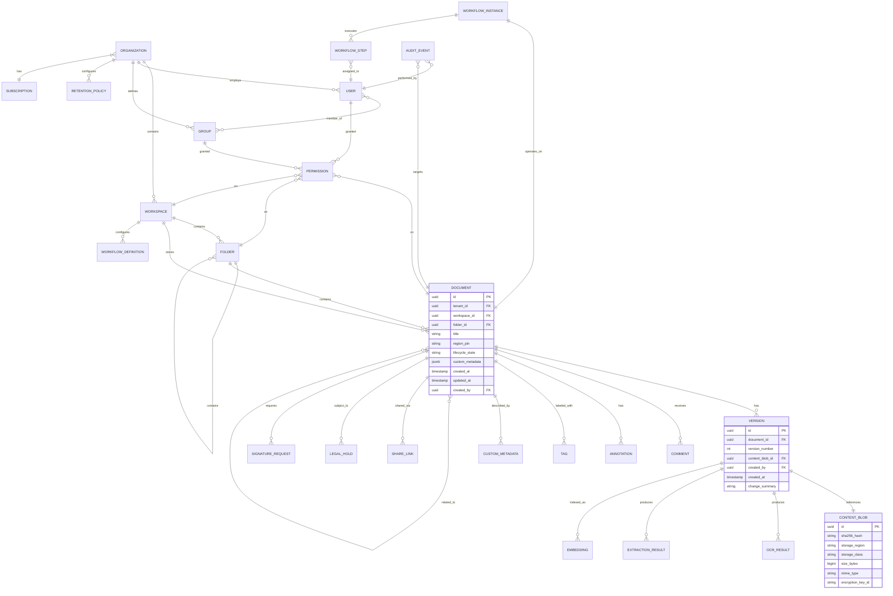
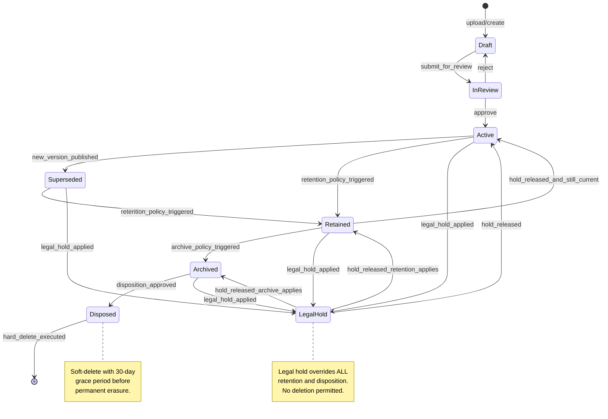

    # Document Management System (DMS) — Enterprise Architectural Blueprint

**Version:** 1.0  
**Date:** April 2026  
**Classification:** Internal — Engineering  
**Author:** Principal Architecture Office  

---

## 1. NORTH STAR + PRODUCT STRATEGY

### 1.1 Positioning Statement

This DMS wins because it is the only platform that unifies content intelligence (OCR, classification, entity extraction, semantic search, RAG-powered Q&A) with deployment flexibility (SaaS, on-prem, hybrid, air-gapped) in a single codebase, while enforcing per-document data residency at every layer — database, storage, search index, cache, logs, and backups. Incumbents force customers to choose between intelligence and control; we deliver both without compromise.

### 1.2 Top 3 Differentiators

**1. Deployment-Agnostic Single Codebase.** Box and NetDocuments are SaaS-only. OpenText and Laserfiche are legacy on-prem struggling to add cloud. M-Files bridges both but with two divergent codebases. We ship one Kubernetes-native binary that runs identically on AWS/GCP/Azure, on a customer's VMware cluster, or in an air-gapped SCIF. The same Helm chart, the same API surface, the same admin console. On-prem customers get SaaS-grade intelligence features (OCR, classification) with bundled models that run offline.

**2. Per-Document Data Residency Enforcement.** SharePoint and Box offer region selection at the tenant level. We enforce it at the document level — a single workspace can contain documents pinned to UAE, EU, and US simultaneously. This is enforced through a `region_pin` column on every document row, with middleware that validates region constraints on every write path (DB, blob, search index, cache eviction, log shipping, backup routing). No other DMS does this at the individual document granularity.

**3. Embedded Document Intelligence with Vendor-Neutral LLM Routing.** iManage RAVN and M-Files offer basic classification. We provide a full intelligence pipeline — OCR, structured extraction, classification, NER, PII redaction, semantic search, and RAG Q&A — with a vendor-neutral LLM abstraction layer that routes per-tenant to OpenAI, Anthropic, AWS Bedrock, or locally-hosted Llama/Mistral. Air-gapped customers get the same features without any external API dependency.

### 1.3 What We Will NOT Do

- **We are not a general-purpose file sync/share tool.** No consumer tier, no personal photo backup, no unlimited free storage. We are enterprise-only.
- **We will not build a full office suite.** We integrate with OnlyOffice/Collabora/Microsoft 365 for co-authoring. We render and annotate, we do not edit natively.
- **We will not build email.** We ingest email and attachments; we do not replace Outlook or Gmail.
- **We will not build ERP/CRM connectors in-house beyond the top 10.** We provide a connector SDK and marketplace for long-tail integrations.
- **We will not attempt real-time collaborative database editing** (like Notion or Airtable). Our metadata model is document-centric, not spreadsheet-centric.
- **We will not support Internet Explorer or legacy browsers.** Chrome 90+, Firefox 90+, Safari 15+, Edge 90+.

### 1.4 Pricing Model Hypothesis

**Hybrid per-user + per-GB + consumption model:**

| Component | Price | Rationale |
|-----------|-------|-----------|
| Base platform license | $15/user/month (Standard), $35/user/month (Enterprise) | Aligns with Box Business ($20) and M-Files ($39). Enterprise includes advanced compliance, workflow, and API access. |
| Storage | $0.10/GB/month (hot), $0.03/GB/month (warm), $0.008/GB/month (cold) | Slight premium over raw cloud storage; covers replication, indexing overhead, and compliance metadata. |
| OCR processing | $0.01/page (self-hosted tier), $0.04/page (premium quality tier using managed APIs) | At 100M pages/year, this is $1M–$4M revenue at near-zero marginal cost for self-hosted. |
| eSignatures | $1.50/envelope (first-party), pass-through + 20% for DocuSign/Adobe Sign | High-margin add-on with clear per-transaction value. |
| AI Intelligence Pack | $5/user/month add-on | Covers RAG Q&A, semantic search, auto-classification. LLM inference costs ~$0.50/user/month at moderate usage. |

**On-prem licensing:** Annual subscription at 2.5× SaaS equivalent, includes support + updates. Perpetual license at 5× annual, with 20% annual maintenance.

**Rationale:** Per-user creates predictable revenue. Per-GB prevents abuse and aligns cost with value (a customer with 50 TB is getting more value than one with 500 GB). Consumption pricing for OCR and signatures captures value from high-volume use cases without penalizing light users.

---

## 2. DOMAIN MODEL

### 2.1 Core Entity Relationships



### 2.2 Tenant Model

```
Organization (tenant boundary — billing, compliance, data isolation)
  └── Workspace (logical container — e.g., "Legal Department", "Project Alpha")
       ├── Team (permission group scoped to workspace)
       │    └── User (inherits team permissions, can have direct grants)
       └── Folder (hierarchical container within workspace)
            └── Document (the atomic unit — has versions, metadata, permissions)
```

**Key rules:**
- A User belongs to exactly one Organization but can be a member of multiple Workspaces.
- A Document exists in exactly one Workspace and one Folder (no multi-parent).
- Cross-workspace links are soft references (UUID pointers), not hard containment.
- Permissions cascade: Organization → Workspace → Folder → Document, with explicit overrides at any level.
- `tenant_id` is denormalized onto every row in every table. No query ever runs without `WHERE tenant_id = ?`.

### 2.3 Document Lifecycle State Machine



### 2.4 Glossary

| Term | Definition |
|------|-----------|
| **Tenant** | An isolated organization with its own data, users, and configuration. Maps 1:1 to a billing entity. |
| **Workspace** | A logical boundary within a tenant for organizing documents by department, project, or function. |
| **Document** | The logical entity representing a piece of content. Has one or more Versions. |
| **Version** | An immutable snapshot of a document's content at a point in time. Points to a Content Blob. |
| **Content Blob** | The actual binary file stored in object storage. Content-addressed by SHA-256. |
| **Region Pin** | A mandatory attribute on every document specifying the geographic region where all its data (blob, metadata, index, cache) must reside. |
| **Lifecycle State** | The current phase of a document in its lifecycle (Draft, InReview, Active, Superseded, Retained, Archived, Disposed, LegalHold). |
| **Retention Policy** | A rule defining how long documents of a given class must be kept before archival or disposition. |
| **Legal Hold** | A tamper-proof directive that prevents any modification or deletion of subject documents, overriding retention policies. |
| **Disposition** | The act of permanently deleting a document after its retention period expires and no holds apply. |
| **Custom Metadata** | Tenant-defined key-value fields attached to documents (e.g., "Contract Value", "Expiry Date"). Stored as JSONB with per-tenant JSON Schema validation. |
| **Permission** | An access control entry granting a user or group a specific capability (view, edit, delete, share, admin) on a resource. |
| **Share Link** | A time-limited, optionally password-protected URL granting external access to a document. |
| **Workflow Definition** | A reusable template defining a sequence of steps (approvals, reviews, tasks) that can be instantiated on documents. |
| **Workflow Instance** | A running execution of a workflow definition, bound to a specific document. |
| **Extraction Result** | Structured data extracted from a document version (e.g., invoice fields, contract clauses). |
| **Embedding** | A dense vector representation of document content used for semantic search and similarity detection. |
| **Audit Event** | An immutable, hash-chained log entry recording a user action or system event. |
| **Content Address** | The SHA-256 hash of a file's contents, used for deduplication and integrity verification. |
| **WORM** | Write Once Read Many — immutable storage mode required for certain compliance regimes. |
| **Envelope Encryption** | A two-tier encryption scheme where data is encrypted with a DEK, and the DEK is encrypted with a KEK managed by KMS. |
| **BYOK/HYOK** | Bring Your Own Key / Hold Your Own Key — customer-managed encryption key arrangements. |

### 2.5 Event Taxonomy

Every domain event follows the CloudEvents v1.0 specification with this envelope:

```json
{
  "specversion": "1.0",
  "id": "uuid-v7",
  "source": "dms.{service}.{instance}",
  "type": "com.dms.{domain}.{action}.{version}",
  "subject": "{resource_type}/{resource_id}",
  "time": "ISO-8601",
  "datacontenttype": "application/json",
  "tenantid": "uuid",
  "regionpin": "us-east-1",
  "correlationid": "uuid",
  "data": { ... }
}
```

**Complete event catalog:**

| Domain | Event Type | Payload (key fields) |
|--------|-----------|---------------------|
| Document | `document.created.v1` | `{doc_id, workspace_id, folder_id, title, created_by, region_pin}` |
| Document | `document.updated.v1` | `{doc_id, changed_fields[], updated_by}` |
| Document | `document.moved.v1` | `{doc_id, from_folder, to_folder, moved_by}` |
| Document | `document.deleted.v1` | `{doc_id, deleted_by, soft_delete: true}` |
| Document | `document.purged.v1` | `{doc_id, purged_by, reason}` |
| Document | `document.state_changed.v1` | `{doc_id, from_state, to_state, changed_by, reason}` |
| Version | `version.created.v1` | `{version_id, doc_id, version_number, content_blob_id, size_bytes, mime_type}` |
| Version | `version.ocr_completed.v1` | `{version_id, page_count, language, confidence_avg}` |
| Version | `version.extraction_completed.v1` | `{version_id, extraction_type, field_count}` |
| Version | `version.classified.v1` | `{version_id, doc_class, confidence, method}` |
| Version | `version.embedded.v1` | `{version_id, embedding_model, chunk_count}` |
| Permission | `permission.granted.v1` | `{resource_type, resource_id, principal_type, principal_id, capability}` |
| Permission | `permission.revoked.v1` | `{resource_type, resource_id, principal_type, principal_id, capability}` |
| Share | `share_link.created.v1` | `{link_id, doc_id, created_by, expires_at, password_protected}` |
| Share | `share_link.accessed.v1` | `{link_id, accessor_ip, accessor_email}` |
| Workflow | `workflow.started.v1` | `{instance_id, definition_id, doc_id, started_by}` |
| Workflow | `workflow.step_completed.v1` | `{instance_id, step_id, completed_by, outcome}` |
| Workflow | `workflow.completed.v1` | `{instance_id, final_outcome, duration_ms}` |
| Search | `search.executed.v1` | `{query_hash, result_count, latency_ms, user_id}` |
| Auth | `user.login.v1` | `{user_id, method, ip, user_agent, mfa_used}` |
| Auth | `user.login_failed.v1` | `{attempted_email, ip, reason}` |
| Compliance | `legal_hold.applied.v1` | `{hold_id, doc_ids[], applied_by, matter_name}` |
| Compliance | `legal_hold.released.v1` | `{hold_id, released_by}` |
| Compliance | `retention.disposition_executed.v1` | `{doc_id, policy_id, disposition_type}` |
| Compliance | `data_subject.export_requested.v1` | `{request_id, subject_email, requested_fields[]}` |
| Compliance | `data_subject.erasure_executed.v1` | `{request_id, records_erased}` |
| Signature | `signature.requested.v1` | `{request_id, doc_id, signers[], requested_by}` |
| Signature | `signature.completed.v1` | `{request_id, signer_id, timestamp, certificate_id}` |
| Intelligence | `redaction.completed.v1` | `{version_id, entities_redacted, method}` |
| Intelligence | `summary.generated.v1` | `{doc_id, model_used, token_count}` |
| Billing | `usage.metered.v1` | `{tenant_id, metric, quantity, period}` |

---

## 3. HIGH-LEVEL SYSTEM DECOMPOSITION

### 3.1 Service Map (C4 Container Diagram)

```mermaid
C4Container
    title DMS Platform - Container Diagram

    Person(user, "User", "Enterprise user accessing DMS")
    Person(admin, "Admin", "Tenant administrator")
    Person(external, "External Recipient", "Shared link viewer")

    System_Boundary(dms, "DMS Platform") {
        Container(gateway, "API Gateway", "Kong/Envoy", "Rate limiting, AuthN, routing, TLS termination")
        Container(web, "Web Application", "React SPA", "Document UI, admin console, workflow designer")
        Container(docservice, "Document Service", "Go", "CRUD, versioning, metadata, lifecycle state machine")
        Container(storageservice, "Storage Service", "Go", "Upload/download orchestration, dedup, encryption")
        Container(searchservice, "Search Service", "Go", "Lexical + semantic hybrid search, faceting, permission filtering")
        Container(intelligenceservice, "Intelligence Service", "Python", "OCR, extraction, classification, NER, embedding, redaction")
        Container(workflowservice, "Workflow Service", "Go + Temporal", "Workflow execution, approvals, task management")
        Container(authservice, "Auth Service", "Go", "AuthN, session mgmt, SSO, MFA, SCIM")
        Container(policyservice, "Policy Service", "Go + OPA", "AuthZ evaluation, ABAC policies, permission checks")
        Container(notifservice, "Notification Service", "Go", "Email, push, in-app, Slack/Teams, SMS delivery")
        Container(auditservice, "Audit Service", "Go", "Hash-chained audit log, compliance reporting")
        Container(billingservice, "Billing Service", "Go", "Metering, usage tracking, Stripe integration")
        Container(signatureservice, "Signature Service", "Go", "eSign orchestration, certificate management, LTV")
        Container(previewservice, "Preview Service", "Python", "Thumbnail generation, format conversion, PDF render")
        Container(collabservice, "Collaboration Service", "Node.js", "WebSocket, presence, comments, real-time sync")
        Container(connectorservice, "Connector Service", "Go", "CRM/ERP/Email integrations, webhook delivery")

        ContainerDb(pgprimary, "PostgreSQL Primary", "PostgreSQL 16", "Documents, metadata, permissions, tenants")
        ContainerDb(opensearch, "OpenSearch", "OpenSearch 2.x", "Full-text search, faceted queries")
        ContainerDb(qdrant, "Qdrant", "Qdrant", "Vector embeddings for semantic search")
        ContainerDb(redis, "Redis Cluster", "Redis 7", "Session cache, rate limiting, real-time presence")
        ContainerDb(objectstore, "Object Storage", "S3/MinIO", "Binary content blobs")

        Container(eventbus, "Event Bus", "NATS JetStream", "Async event delivery between services")
        Container(taskqueue, "Task Queue", "Temporal", "Long-running job orchestration")
    }

    System_Ext(idp, "Identity Provider", "Customer SAML/OIDC IdP")
    System_Ext(kms, "Key Management", "AWS KMS / Vault")
    System_Ext(llm, "LLM Provider", "OpenAI / Anthropic / Bedrock / Local")
    System_Ext(esign, "eSign Provider", "DocuSign / Adobe Sign")
    System_Ext(email, "Email Service", "SES / SendGrid")

    Rel(user, gateway, "HTTPS")
    Rel(external, gateway, "HTTPS (share links)")
    Rel(gateway, web, "Serves SPA")
    Rel(gateway, docservice, "REST/gRPC")
    Rel(docservice, pgprimary, "SQL")
    Rel(docservice, eventbus, "Publishes events")
    Rel(storageservice, objectstore, "S3 API")
    Rel(searchservice, opensearch, "Query")
    Rel(searchservice, qdrant, "ANN query")
    Rel(intelligenceservice, llm, "Inference API")
    Rel(authservice, idp, "SAML/OIDC")
    Rel(policyservice, redis, "Policy cache")
    Rel(signatureservice, esign, "API")
    Rel(notifservice, email, "SMTP/API")
```



### 3.2 Service Details

| Service | Responsibility | Tech Stack | Owned Data | APIs Exposed | APIs Consumed | Scaling Dimension | Does NOT Do |
|---------|---------------|------------|-----------|-------------|--------------|-------------------|-------------|
| **Document Service** | Document CRUD, versioning, metadata, lifecycle state machine, folder management | Go 1.22, gRPC + REST | `documents`, `versions`, `folders`, `custom_metadata`, `tags` tables | gRPC: `DocumentService`, REST: `/api/v1/documents/**` | Storage Service (blob ops), Policy Service (authz), Event Bus (publish) | Horizontal by tenant_id hash | Does NOT store blobs, does NOT run search queries, does NOT execute workflows |
| **Storage Service** | Upload/download orchestration, presigned URLs, chunked upload, dedup, virus scan coordination, encryption | Go 1.22, gRPC | `content_blobs`, `upload_sessions` tables | gRPC: `StorageService`, REST: `/api/v1/uploads/**` | Object Storage (S3 API), KMS (key ops) | Horizontal; I/O bound | Does NOT manage document metadata, does NOT serve search |
| **Search Service** | Hybrid lexical+semantic search, faceting, permission-filtered queries, autocomplete, saved searches | Go 1.22, gRPC + REST | OpenSearch indices, Qdrant collections | REST: `/api/v1/search/**`, gRPC: `SearchService` | OpenSearch, Qdrant, Policy Service (permission filter), Document Service (metadata) | Horizontal; CPU + memory intensive | Does NOT store primary document data, does NOT perform writes to documents |
| **Intelligence Service** | OCR, structured extraction, classification, NER, embedding generation, redaction, RAG Q&A, summary | Python 3.12, FastAPI, gRPC | `ocr_results`, `extraction_results`, `classifications`, `embeddings` tables | gRPC: `IntelligenceService`, REST: `/api/v1/intelligence/**` | LLM providers, Storage Service (fetch blobs), Event Bus (publish results) | Horizontal + GPU nodes for OCR/embedding; job-queue based | Does NOT serve documents, does NOT enforce permissions |
| **Workflow Service** | Workflow definition, execution, approval routing, task management, escalation, deadlines | Go 1.22 + Temporal SDK | `workflow_definitions`, `workflow_instances`, `tasks` tables; Temporal namespace | REST: `/api/v1/workflows/**`, gRPC: `WorkflowService` | Document Service (state transitions), Notification Service (alerts), Policy Service | Horizontal by active workflow count | Does NOT render UI, does NOT handle document storage |
| **Auth Service** | Authentication, session management, SSO (SAML/OIDC), MFA, SCIM provisioning, API key management | Go 1.22, REST | `users`, `sessions`, `api_keys`, `mfa_devices`, `sso_configs` tables | REST: `/api/v1/auth/**`, `/api/v1/scim/**` | IdP (SAML/OIDC), LDAP/AD, Event Bus | Horizontal; session-heavy | Does NOT make authorization decisions (delegates to Policy Service) |
| **Policy Service** | Authorization evaluation, ABAC policy engine, permission CRUD, role management | Go 1.22, OPA sidecar, gRPC | `permissions`, `roles`, `policies` tables; OPA policy bundles | gRPC: `PolicyService` (high-frequency, low-latency) | Redis (policy/permission cache) | Horizontal; latency-critical (p99 < 5ms) | Does NOT authenticate users, does NOT manage sessions |
| **Notification Service** | Multi-channel notification delivery, preference management, template rendering | Go 1.22, REST | `notification_preferences`, `notification_log` tables | REST: `/api/v1/notifications/**` | Email (SES/SendGrid), Push (FCM/APNs), Slack/Teams APIs | Horizontal by queue depth | Does NOT decide what to notify about (receives events) |
| **Audit Service** | Tamper-evident logging, compliance reporting, hash-chain maintenance, SOC 2 evidence generation | Go 1.22, gRPC + REST | `audit_events` table (append-only, hash-chained) | REST: `/api/v1/audit/**`, gRPC: `AuditService` | Event Bus (consumes all events) | Horizontal for write; read replicas for queries | Does NOT modify any business data |
| **Billing Service** | Usage metering, subscription management, invoice generation, Stripe integration | Go 1.22, REST | `subscriptions`, `usage_meters`, `invoices` tables | REST: `/api/v1/billing/**` | Stripe API, Event Bus (consumes usage events) | Single-leader per region | Does NOT enforce access (only tracks) |
| **Signature Service** | eSignature orchestration, certificate management, LTV, audit trail, third-party integration | Go 1.22, REST | `signature_requests`, `certificates`, `signature_events` tables | REST: `/api/v1/signatures/**` | DocuSign/Adobe Sign APIs, PKI/CA, Storage Service | Horizontal by active request count | Does NOT store documents (only references) |
| **Preview Service** | Thumbnail/preview generation, format conversion (LibreOffice headless), PDF rendering | Python 3.12, Celery workers | `preview_cache` table, preview blobs in object storage | gRPC: `PreviewService` | Storage Service (fetch originals), Object Storage (store previews) | Horizontal GPU/CPU workers; burst scaling | Does NOT serve previews directly to users (CDN does) |
| **Collaboration Service** | WebSocket management, real-time presence, comment threading, @mentions, co-authoring relay | Node.js 22, WebSocket | `comments`, `annotations`, `presence` (in Redis) | WebSocket: `/ws/collab`, REST: `/api/v1/comments/**` | Redis (presence/pub-sub), Document Service | Horizontal by WebSocket connection count | Does NOT persist document changes (relays to Document Service) |
| **Connector Service** | Third-party integrations (CRM/ERP/Email), webhook delivery, event streaming to customers | Go 1.22, REST | `connector_configs`, `webhook_subscriptions`, `webhook_deliveries` tables | REST: `/api/v1/connectors/**`, `/api/v1/webhooks/**` | Salesforce, SAP, M365, Google, etc. APIs | Horizontal by connector count | Does NOT process document content |

### 3.3 Sync vs Async Integration Patterns

| Producer → Consumer | Pattern | Transport | Rationale |
|---------------------|---------|-----------|-----------|
| API Gateway → Any Service | Synchronous | gRPC (internal), REST (external) | User-facing latency requirements demand synchronous request/response |
| Document Service → Search Service | Async | NATS JetStream (`doc.index.*`) | Search indexing is eventually consistent; decouples write path from index path |
| Document Service → Intelligence Service | Async | NATS JetStream (`doc.intelligence.*`) | OCR/extraction are long-running (seconds to minutes); fire-and-forget |
| Any Service → Audit Service | Async | NATS JetStream (`audit.*`) | Audit writes must not block business operations |
| Workflow Service → Notification Service | Async | NATS JetStream (`notify.*`) | Notification delivery is best-effort with retries |
| Document Service → Policy Service | Synchronous | gRPC | Permission checks are in the hot path; must be < 5ms |
| Storage Service → Preview Service | Async | NATS JetStream (`preview.generate.*`) | Preview generation is background work |
| Any Service → Billing Service | Async | NATS JetStream (`billing.meter.*`) | Metering is fire-and-forget with at-least-once delivery |
| Connector Service → External Webhooks | Async | HTTP with retry queue (SQS/NATS) | External delivery is unreliable; needs exponential backoff + DLQ |

### 3.4 Avoiding the Distributed Monolith Trap

**Rules we enforce:**

1. **No synchronous call chains > 3 hops.** If a request touches more than 3 services synchronously, we redesign. The only allowed chain is: Gateway → Document Service → Policy Service (authz) → response. Any further processing is async.

2. **Each service owns its data exclusively.** No shared databases. The Document Service never reads the `permissions` table directly — it calls the Policy Service. The Search Service maintains its own denormalized index; it does not query `documents` directly.

3. **No distributed transactions.** We use the Saga pattern (orchestrated by Temporal) for multi-service operations. Example: "Upload document" is a saga with steps: (1) create document record, (2) upload blob, (3) trigger OCR, (4) index for search. If step 2 fails, step 1 is compensated.

4. **Independent deployability.** Every service has its own CI/CD pipeline, its own database migrations, its own feature flags. Deploying the Intelligence Service never requires deploying the Document Service.

5. **API contracts are versioned and backward-compatible.** gRPC protobuf with field-level deprecation. Breaking changes require a new major version and a 6-month migration window.

6. **Circuit breakers on every synchronous call.** If the Policy Service is down, the Document Service fails open to a cached permission set (with a TTL of 60 seconds, then hard-fails). This is acceptable because the blast radius is limited to "slightly stale permissions for 60 seconds" vs "entire system down."

---

## 4. DATA ARCHITECTURE

### 4.1 Primary Database: PostgreSQL 16

**Why PostgreSQL:**
- JSONB for custom metadata with GIN indexes — eliminates EAV tables entirely
- Row-level security (RLS) for multi-tenant isolation at the database layer
- Excellent ACID guarantees, logical replication, PITR
- `pg_partitioning` for time-based partitioning of audit logs and event tables
- Extension ecosystem: `pgvector` for embeddings (small tenants), `pg_cron` for scheduled jobs, `pg_stat_statements` for query analysis
- Broad on-prem support — customers can run it themselves, unlike managed-only databases

**Where PostgreSQL is NOT the right choice:**
- **Search at 1B docs:** OpenSearch/Elasticsearch (see 4.4)
- **Vector similarity at scale:** Qdrant (see 4.5) — pgvector works to ~10M vectors but struggles beyond with recall/latency tradeoffs
- **Real-time presence/sessions:** Redis
- **Event streaming:** NATS JetStream (not Kafka — NATS is simpler to operate, has lower resource overhead, and JetStream provides the persistence guarantees we need at our scale without Kafka's operational complexity)

**Cheaper alternative rejected:** MySQL 8. Lacks JSONB with GIN indexes, RLS, and the extension ecosystem. The custom metadata query performance alone justifies Postgres.

### 4.2 Multi-Tenancy Strategy

| Tier | Isolation Level | Trigger to Upgrade | Implementation |
|------|----------------|-------------------|----------------|
| **Shared** (90% of tenants) | Shared schema, row-level security via `tenant_id` column + RLS policies | Default for all Standard-tier accounts | Every table has `tenant_id` column, composite primary keys `(tenant_id, id)`, RLS policy: `USING (tenant_id = current_setting('app.current_tenant')::uuid)` |
| **Schema-per-tenant** (8% of tenants) | Separate Postgres schema per tenant, same cluster | Enterprise tier, > 1M documents, or customer contractual requirement | Schema created on tenant provisioning, connection routing via `SET search_path`. Migrations run per-schema. |
| **Database-per-tenant** (2% of tenants) | Dedicated Postgres instance or cluster | Regulated (HIPAA/FedRAMP), on-prem deployment, or customer paying for dedicated infrastructure | Separate RDS instance / dedicated Postgres cluster. Connection string stored in tenant registry. Full isolation including backup schedules, maintenance windows. |

**Upgrade triggers (automated recommendation, manual approval):**
- Document count > 1M → recommend schema-per-tenant
- Storage > 1 TB → recommend schema-per-tenant
- Regulatory flag (HIPAA, FedRAMP) → require database-per-tenant
- Query latency p99 > 500ms consistently → investigate, potentially upgrade
- Customer contractual clause specifying "dedicated infrastructure"

### 4.3 Blob Storage

**Architecture:** Per-region native object storage with lifecycle policies.

| Storage Class | Use Case | Retrieval Latency | Cost (S3 equivalent) | Lifecycle Trigger |
|---------------|----------|-------------------|---------------------|-------------------|
| Hot (S3 Standard) | Active documents, recently uploaded | < 100ms | $0.023/GB/month | Default for first 90 days |
| Warm (S3 IA) | Documents not accessed in 90 days | < 100ms (higher per-request cost) | $0.0125/GB/month | No access for 90 days |
| Cold (S3 Glacier IR) | Archived documents, legal hold | < 5 minutes | $0.004/GB/month | Lifecycle state = Archived |
| Deep Cold (S3 Glacier Deep) | Disposed but retention-required | < 12 hours | $0.00099/GB/month | Lifecycle state = Disposed + retention active |

**Region enforcement:** Blob storage buckets are created per-region. The Storage Service reads `region_pin` from the document metadata and routes to the correct regional bucket. Cross-region replication is opt-in and controlled by tenant policy (some tenants explicitly forbid it for data sovereignty reasons).

**On-prem divergence:** MinIO with erasure coding replaces S3. Storage classes map to MinIO tiers backed by different storage hardware (SSD vs HDD vs tape library). Same lifecycle policy engine, different backend.

**Deduplication:** Content-addressed by SHA-256. Before upload, client sends hash; if blob exists in the same region, we skip upload and increment reference count. Cross-tenant dedup is disabled for security (tenant A's hash should not reveal that tenant B has the same file). Within-tenant dedup saves ~15-25% storage for typical enterprise deployments.

### 4.4 Search: OpenSearch 2.x

**Why OpenSearch over alternatives:**

| Option | Verdict | Reason |
|--------|---------|--------|
| **OpenSearch 2.x** | **CHOSEN** | Battle-tested at 1B+ docs (Amazon, Netflix scale). Rich aggregation framework for faceted search. k-NN plugin for hybrid search. Apache 2.0 licensed — no vendor lock-in. Strong on-prem story. |
| Elasticsearch 8.x | Rejected | SSPL license is toxic for on-prem distribution. Feature-equivalent to OpenSearch for our use case. |
| Typesense | Rejected | Excellent for small-to-medium scale (< 100M docs) but unproven at 1B. Lacks the aggregation depth we need for complex faceted search with permission filtering. |
| Vespa | Considered | Strong hybrid search. But operational complexity is higher than OpenSearch, smaller ecosystem, harder for on-prem customers to manage. |
| PostgreSQL full-text | Rejected for primary search | Fine for < 1M docs. At 1B docs, pg_trgm and tsvector cannot compete with inverted index performance. We use Postgres FTS as a fallback for air-gapped deployments where OpenSearch is too heavy. |

**Index design at 1B docs:**
- Sharding: by `tenant_id` (routing key) + time-based index rollover (monthly indices for large tenants, quarterly for small)
- Target: 30-50 GB per shard, ~20 primary shards per index
- Replication factor: 2 (SaaS), 1 (on-prem small), configurable
- Document mapping includes: title, full-text content (extracted), custom metadata fields (dynamic mapping), tags, lifecycle state, region_pin, permission_group_ids (for filtering)

### 4.5 Vector Store: Qdrant

**Why Qdrant:**
- Purpose-built for dense vector search with filtering (critical for permission-filtered semantic search)
- Rust-based, high performance: 1M vectors with 768 dimensions queried in < 10ms
- Supports payload filtering (tenant_id, permission groups) during ANN search — not as a post-filter
- On-prem friendly: single binary, no JVM, minimal resource overhead
- Sharding and replication built-in

**Cheaper alternative rejected:** pgvector. Works well to ~10M vectors. At 1B documents with ~5B chunks (5 chunks/doc average), pgvector's HNSW index consumes excessive memory and query latency degrades past 50ms at p99. Qdrant at this scale maintains < 15ms p99 with proper sharding.

**Sharding strategy:** Collection-per-tenant for large tenants (> 100K docs). Shared collection with tenant_id payload filter for small tenants. Automatic promotion when a tenant exceeds 100K documents.

### 4.6 Metadata Indexing

**Approach: JSONB + generated columns + GIN indexes.**

Custom metadata is stored as a JSONB column on the `documents` table. Each tenant defines a JSON Schema for their metadata fields. The schema is stored in `tenant_metadata_schemas` and validated on write.

```sql
-- Document table
CREATE TABLE documents (
    tenant_id UUID NOT NULL,
    id UUID NOT NULL,
    title TEXT NOT NULL,
    custom_metadata JSONB DEFAULT '{}',
    -- Generated columns for frequently-queried fields (per-tenant optimization)
    PRIMARY KEY (tenant_id, id)
);

-- GIN index on custom_metadata for arbitrary key-value queries
CREATE INDEX idx_documents_metadata ON documents USING GIN (custom_metadata);

-- For high-frequency queries on specific fields, add generated columns:
-- ALTER TABLE documents ADD COLUMN contract_value NUMERIC
--   GENERATED ALWAYS AS ((custom_metadata->>'contract_value')::numeric) STORED;
-- CREATE INDEX idx_contract_value ON documents (tenant_id, contract_value);
```

**Why not EAV:** Entity-Attribute-Value tables create quadratic join complexity. Querying "find all contracts with value > $1M AND expiry before 2025" requires two self-joins. With JSONB + GIN, it's a single indexed query: `WHERE custom_metadata @> '{"doc_type": "contract"}' AND (custom_metadata->>'contract_value')::numeric > 1000000`.

**Performance at scale:** GIN indexes on JSONB handle 100M rows with < 50ms query latency for containment queries. For range queries on specific fields (dates, numbers), we create generated columns + B-tree indexes on demand when a tenant's metadata schema stabilizes.

### 4.7 Event Log / Outbox Pattern

**Transactional outbox implementation:**

Every service that publishes events uses the outbox pattern to guarantee exactly-once delivery:

```sql
-- Within the same transaction as the business operation:
BEGIN;
INSERT INTO documents (...) VALUES (...);
INSERT INTO outbox (id, event_type, payload, created_at, published)
VALUES (gen_random_uuid(), 'document.created.v1', '{"doc_id": "..."}', now(), false);
COMMIT;
```

A dedicated outbox publisher (Debezium CDC on the outbox table, or a polling publisher) reads unpublished events and publishes to NATS JetStream, then marks them as published.

**When to adopt CQRS:**
- **Search reads:** Already CQRS. The Search Service maintains a read-optimized index that is eventually consistent with the Document Service's write model. Acceptable staleness: < 2 seconds.
- **Audit reads:** CQRS. Audit events are written to an append-only table and replicated to a read-optimized analytics store (ClickHouse or TimescaleDB) for reporting.
- **Document CRUD:** NOT CQRS. Read-after-write consistency is critical for document operations. Users expect to upload a file and immediately see it in the folder listing. We use read replicas for heavy reporting queries but the primary write model serves reads for interactive use.

**When CQRS is overkill:** For the notification preferences, billing configuration, and tenant settings — these are simple CRUD domains with low write volume. Adding CQRS would double the infrastructure cost for zero benefit.

### 4.8 Backup & DR

| Tier | RPO | RTO | Implementation |
|------|-----|-----|----------------|
| **SaaS Shared** | 1 hour | 4 hours | Continuous WAL archiving to S3, PITR. Daily logical backup snapshots. Cross-region replication with 15-minute lag. |
| **SaaS Enterprise** | 15 minutes | 1 hour | Streaming replication to standby in secondary region. Automated failover via Patroni. Blob replication via S3 CRR. |
| **On-prem Standard** | 24 hours | 8 hours | Customer-managed pg_dump + WAL archiving. We provide scripts and runbooks. |
| **On-prem Premium** | 1 hour | 2 hours | Patroni-managed HA cluster with automated failover. We provide the Helm chart and monitoring. |

**Backup testing cadence:** Automated restore-from-backup test weekly in SaaS. Monthly DR drill with simulated region failure. Quarterly game day with the on-call team.

**Chaos engineering:** We run Chaos Monkey (random pod kill), Chaos Kong (simulated region failure), and Latency Monkey (injected network delays) continuously in staging. Monthly chaos exercises in production with a blast radius limited to a single non-critical service.

---

## 5. FILE STORAGE & CONTENT SERVICES

### 5.1 Upload Flow

```
Client                    API Gateway          Storage Service         Object Store        Antivirus
  │                          │                      │                     │                   │
  ├─ POST /uploads ──────────►                      │                     │                   │
  │  {filename, size, hash}  ├─ Create upload ──────►                     │                   │
  │                          │  session             │                     │                   │
  │  ◄─ {upload_id, ─────────┤                      │                     │                   │
  │     presigned_urls[],    │                      │                     │                   │
  │     part_size}           │                      │                     │                   │
  │                          │                      │                     │                   │
  ├─ PUT part 1 ─────────────────────────────────────────────────────────►│                   │
  ├─ PUT part 2 ─────────────────────────────────────────────────────────►│                   │
  ├─ ...                     │                      │                     │                   │
  │                          │                      │                     │                   │
  ├─ POST /uploads/{id}/     │                      │                     │                   │
  │  complete ───────────────►─ Complete multipart ──►─ Complete upload ──►│                   │
  │                          │                      │                     │                   │
  │                          │                      ├─ Fetch for scan ────────────────────────►│
  │                          │                      │                     │  ◄── scan result ──┤
  │                          │                      │                     │                   │
  │  ◄─ 201 Created ─────────┤                      │                     │                   │
```

**Details:**
- **< 100 MB files:** Single PUT with presigned URL. Simple, fast.
- **100 MB – 5 GB:** S3 multipart upload with 100 MB parts. Client uploads parts in parallel (up to 4 concurrent).
- **> 5 GB:** TUS protocol (resumable uploads). The Storage Service acts as a TUS server, proxying chunks to S3 multipart. TUS handles resume-after-disconnect.
- **Virus scanning:** ClamAV (self-hosted) for SaaS. On upload completion, the blob is scanned before the document transitions from "uploading" to "draft" state. Infected files are quarantined (moved to quarantine bucket) and the user is notified. Scanning runs async but blocks the state transition — the document is not visible in the UI until scan completes (typically < 5 seconds for files under 100 MB).
- **On-prem divergence:** MinIO replaces S3 for presigned URL generation. Same multipart protocol. ClamAV runs locally.

### 5.2 Download Flow

**Two modes:**

1. **Presigned URL (default for trusted internal users):** Storage Service generates a time-limited (5 minute) presigned S3 GET URL. Client downloads directly from S3/MinIO. Fast, no proxy overhead.

2. **Proxied download (required for watermarking, DRM, share links, external recipients):** Request goes through the Storage Service, which:
   - Validates the share link / permission
   - Optionally applies a dynamic watermark (user email + timestamp overlaid on PDF pages)
   - Streams the response with `Content-Disposition: attachment`
   - Logs the download event for audit
   - Enforces download count limits if configured

### 5.3 Content Addressing

- **Exact dedup:** SHA-256 hash computed client-side (for integrity check) and server-side (for dedup). If `content_blobs` already contains a row with the same `sha256_hash` in the same region and tenant, we skip the upload and create a new version pointing to the existing blob. Reference counting tracks how many versions point to each blob; blob is deleted when refcount reaches 0.
- **Near-duplicate detection:** MinHash with 128 permutations + LSH (Locality-Sensitive Hashing) with 20 bands. At upload time, the Intelligence Service computes the MinHash signature asynchronously and stores it. Near-dup detection runs as a background job, surfacing "similar documents" in the UI with Jaccard similarity > 0.8.
- **SimHash** for text-heavy documents (contracts, policies): 64-bit fingerprint with Hamming distance < 3 considered near-duplicate.

### 5.4 Thumbnails / Previews

**Generation pipeline:**
1. On version creation, a `preview.generate` event is published.
2. Preview Service picks up the event and generates:
   - Thumbnail: 256×256 JPEG (quality 80) for grid view
   - Preview pages: 1200px-wide PNG for first 5 pages (PDF, Office, images)
   - Full preview: paginated rendering on-demand (not pre-generated for all pages)
3. Generated previews stored in a dedicated `previews` bucket with CDN caching.
4. CDN (CloudFront/Cloudflare) serves previews with signed URLs (1-hour TTL).

**Technology:**
- PDF: `pdf2image` (Poppler) for rasterization, `pdf.js` for client-side rendering
- Office: LibreOffice headless → PDF → rasterize. Average conversion time: 3-8 seconds for a 20-page Word doc.
- Images: `sharp` (libvips) for resize/crop. Sub-second.
- Video: FFmpeg for thumbnail at 5-second mark + HLS transcoding for playback.

### 5.5 Format Support Matrix

| Format | Native Preview | Conversion Required | Engine |
|--------|---------------|-------------------|--------|
| PDF | Yes (pdf.js) | No | Client-side |
| DOCX, XLSX, PPTX | Yes (via conversion) | → PDF | LibreOffice headless |
| DOC, XLS, PPT | Yes (via conversion) | → DOCX → PDF | LibreOffice headless |
| JPEG, PNG, GIF, WebP, TIFF | Yes | No | Client-side `` or canvas |
| SVG | Yes | No | Client-side |
| MP4, WebM, MOV | Yes (streaming) | → HLS segments | FFmpeg |
| MP3, WAV, AAC | Yes (audio player) | No | Client-side `<audio>` |
| TXT, CSV, JSON, XML, Markdown | Yes | No | Client-side with syntax highlighting |
| DWG, DXF (CAD) | Preview only | → SVG/PDF | Open Design Alliance SDK |
| DICOM (medical imaging) | Preview only | → PNG | Cornerstone.js |
| EML, MSG (email) | Yes | Parse + render | Custom parser |

### 5.6 Streaming Video / Large File Playback

Large media files are transcoded to HLS (HTTP Live Streaming) with adaptive bitrate:
- 360p, 720p, 1080p renditions
- 6-second segments stored in object storage
- M3U8 manifest served through CDN with signed URLs
- Playback via hls.js in the client

### 5.7 Immutable Storage (WORM)

For compliance regimes requiring WORM (SEC 17a-4, 21 CFR Part 11):
- S3 Object Lock in Compliance mode (cannot be overridden, even by root account)
- Retention period set per-document based on retention policy
- On-prem: MinIO Object Lock (same API) or dedicated WORM-capable storage (NetApp SnapLock, Dell ECS with Object Lock)

### 5.8 Customer-Managed Encryption (BYOK/HYOK)

**Envelope encryption architecture:**

```
Document Content
    │
    ▼
Encrypted with DEK (Data Encryption Key) — AES-256-GCM
    │
    ▼
DEK encrypted with tenant KEK (Key Encryption Key)
    │
    ▼
KEK stored in:
  - SaaS default: AWS KMS / GCP KMS / Azure Key Vault (Anthropic-managed)
  - BYOK: Customer's KMS; we store the encrypted DEK, customer controls the KEK
  - HYOK: Customer's on-prem HSM; every decrypt operation calls customer's HSM in real-time
```

**HYOK latency impact:** Every document access requires a real-time call to the customer's HSM to unwrap the DEK. This adds 50-200ms per operation. We mitigate by caching unwrapped DEKs in memory (encrypted, with 5-minute TTL) inside a secure enclave (AWS Nitro / SGX) where available.

---

## 6. DOCUMENT INTELLIGENCE

### 6.1 OCR Strategy at 1B Documents

| Solution | Quality | Speed (p95/page) | Cost per page | Arabic Support | On-prem Viable |
|----------|---------|-------------------|---------------|----------------|----------------|
| **Tesseract 5 + LSTM** | Good (92-95% for clean docs) | 1.5s | ~$0.0005 (compute only) | Fair (with arabic-trained model) | Yes |
| **PaddleOCR v4** | Very Good (95-97%) | 0.8s | ~$0.0008 | Good (Baidu trained on Arabic) | Yes |
| **Surya** | Very Good (96-98%) | 1.2s | ~$0.001 | Very Good (multilingual transformer) | Yes |
| **AWS Textract** | Excellent (98-99%) | 2.0s | $0.015 | Good | No |
| **GCP Document AI** | Excellent (98-99%) | 1.8s | $0.01 | Good | No |

**Decision: Tiered approach.**

- **Tier 1 (self-hosted, default):** Surya for general OCR. Best quality-to-cost ratio for multilingual (critical for MENA market). PaddleOCR as fallback for specific document types where it excels (tables, dense forms).
- **Tier 2 (premium, opt-in):** AWS Textract or GCP Document AI for high-value documents where accuracy is critical (medical records, legal contracts). Customer pays the premium OCR rate.
- **Air-gapped:** Surya models bundled with the deployment. No external API calls. Slight quality degradation (~1-2%) vs managed APIs — acceptable for government use cases.

**Cost at 100M pages/year:**
- Self-hosted (Surya): ~$100K/year (GPU compute: 4× A100 instances)
- Premium (Textract): ~$1.5M/year at $0.015/page
- Blended (80% self-hosted, 20% premium): ~$380K/year

### 6.2 Structured Field Extraction

**Hybrid approach: regex/template first, LLM fallback.**

| Method | Cost/doc | Accuracy | Latency | When to use |
|--------|---------|----------|---------|-------------|
| Regex/Template | $0.0001 | 85-95% (on known templates) | < 100ms | Known document templates (invoices from top 50 vendors, standard contracts) |
| LLM (GPT-4o / Claude Sonnet) | $0.02-0.05 | 95-99% | 2-5s | Unknown templates, complex layouts, ambiguous fields |
| Hybrid | $0.003 avg | 95-98% | 200ms avg | Default: regex first, LLM fallback when confidence < 0.8 |

**Trigger for LLM fallback:**
- Regex extraction confidence < 0.8 (based on field validation rules)
- More than 2 fields failed validation
- Document template not recognized (no matching template in the library)

### 6.3 Document Classification

**Three-tier approach:**

1. **Rule-based (cheapest):** Keyword matching + metadata heuristics. "If filename contains 'invoice' AND has a dollar amount → classify as Invoice." Handles ~60% of documents.
2. **Supervised ML:** Fine-tuned DistilBERT classifier trained on customer's labeled data. Handles ~30% of remaining documents. Training automated via active learning pipeline.
3. **LLM zero-shot (most expensive):** For new document types with no training data. Prompt: "Classify this document into one of: [Contract, Invoice, Policy, Memo, Report, Other]. Document text: {first 2000 tokens}." Handles ~10% edge cases.

### 6.4 Duplicate Detection

| Method | Detects | False Positive Rate | Cost | Storage Overhead |
|--------|---------|-------------------|------|-----------------|
| SHA-256 exact hash | Byte-identical copies | 0% | Negligible | 32 bytes/doc |
| MinHash LSH (128 perms, 20 bands) | Near-duplicates (Jaccard > 0.8) | ~2% | $0.001/doc | 512 bytes/doc |
| SimHash (64-bit) | Text-similar documents | ~5% | $0.0005/doc | 8 bytes/doc |
| Embedding cosine similarity (> 0.95) | Semantically equivalent | ~8% | $0.005/doc | 3 KB/doc (768-dim float32) |

All methods run asynchronously post-upload. Results stored in a `duplicate_candidates` table for user review. We never auto-merge — duplicates are surfaced as suggestions.

### 6.5 Version Detection Across Revisions

**Layout-preserving diff using `diff-match-patch` at the text level + structural comparison at the section/paragraph level.**

For contracts and legal documents, we use a specialized diff engine:
- Extract text with position metadata (bounding boxes from OCR)
- Align sections using longest-common-subsequence on section headings
- Within sections, use word-level diff with semantic equivalence (e.g., "30 days" vs "thirty (30) days" are marked as equivalent)
- Render side-by-side with highlighted changes, preserving original layout

### 6.6 Named Entity Recognition (NER)

**Model:** Fine-tuned SpaCy transformer model (for speed) + LLM-based NER (for accuracy on novel entity types).

**Entities detected:**
- PII: names, email addresses, phone numbers, SSN/national IDs, addresses, dates of birth
- Financial: amounts, currencies, account numbers, tax IDs
- Legal: party names, dates, jurisdictions, governing law clauses
- Medical: patient identifiers, diagnoses (ICD codes), procedures (CPT codes)

**Performance:** SpaCy transformer: 500 docs/sec on CPU. LLM-based: 10 docs/sec with batching.

### 6.7 Redaction Pipeline

```
Document → NER (auto-detect PII) → Generate redaction candidates → Human review UI
    → Approve/reject each candidate → Burn-in redactions (permanent) → New version created
```

**Burn-in:** Redacted content is replaced with black rectangles in PDF (using `pymupdf`). The original version is retained (with restricted access) for legal purposes. The redacted version becomes the "active" version.

**Key design decision:** Redaction creates a new version. The original is never modified. Access to the original is restricted to users with the `view_unredacted` permission.

### 6.8 RAG (Retrieval-Augmented Generation)

**Chunk strategy:**
- Split documents into 512-token chunks with 64-token overlap
- Preserve paragraph boundaries (never split mid-sentence)
- For structured documents (contracts), chunk by section/clause
- Store chunks in `document_chunks` table with `(tenant_id, document_id, chunk_index, text, embedding_vector)`

**Re-ranking:** Two-stage retrieval:
1. Stage 1: Retrieve top-50 chunks via hybrid search (BM25 + vector similarity)
2. Stage 2: Re-rank top-50 using a cross-encoder (e.g., `cross-encoder/ms-marco-MiniLM-L-6-v2`) to get top-5
3. Pass top-5 chunks as context to the LLM with citation instructions

**Citation:** LLM response includes `[source: doc_id, page X]` markers. UI renders these as clickable links to the source document at the specific page.

### 6.9 Vendor-Neutral LLM Abstraction

```
Tenant Config          LLM Gateway (LiteLLM)           Providers
─────────────          ───────────────────────          ─────────
Tenant A: OpenAI  ──►  Route to OpenAI GPT-4o     ──► OpenAI API
Tenant B: Anthropic ─► Route to Claude Sonnet      ──► Anthropic API
Tenant C: On-prem ───► Route to local vLLM          ──► Llama 3.1 (GPU cluster)
Tenant D: Bedrock ───► Route to AWS Bedrock         ──► Bedrock API
```

**Implementation:** LiteLLM as the routing gateway. Each tenant configures their preferred LLM provider in their admin console. The Intelligence Service calls LiteLLM with the tenant's provider ID; LiteLLM handles the mapping. For on-prem/air-gapped, LiteLLM routes to a local vLLM instance serving Llama 3.1 70B or Mistral Large.

**Cost tracking:** Every LLM call is metered (input tokens, output tokens, model used) and attributed to the tenant for billing.

---

## 7. SEARCH & DISCOVERY

### 7.1 Hybrid Search Architecture

```
User Query
    │
    ▼
┌─────────────────┐
│ Query Analyzer   │ ── Spell check, synonym expansion, language detection
└────────┬────────┘
         │
    ┌────┴─────┐
    ▼          ▼
┌────────┐ ┌──────────┐
│ BM25   │ │ Dense     │
│ Search │ │ Vector    │
│ (OS)   │ │ (Qdrant)  │
└───┬────┘ └────┬─────┘
    │           │
    └─────┬─────┘
          ▼
┌─────────────────┐
│ Score Fusion     │ ── Reciprocal Rank Fusion (RRF) with α=0.6 lexical, 0.4 semantic
└────────┬────────┘
         ▼
┌─────────────────┐
│ Permission       │ ── Filter results by user's permission groups
│ Filter           │
└────────┬────────┘
         ▼
┌─────────────────┐
│ Learning-to-Rank │ ── XGBoost model trained on click-through data
│ (Phase 2)        │
└────────┬────────┘
         ▼
    Results (top 20)
```

### 7.2 Faceted Search at 100M Docs

OpenSearch aggregations on pre-indexed facet fields: `doc_type`, `workspace_id`, `created_by`, `date_range`, `tags`, `lifecycle_state`, custom metadata fields.

**Performance:** Aggregations on 100M docs with permission filtering: p99 < 500ms. Achieved by:
- Routing queries by `tenant_id` (only scan relevant shards)
- Pre-computed facet counts updated async on document change
- Global ordinals for low-cardinality fields (doc_type, lifecycle_state)

### 7.3 Permission-Filtered Search

**The problem:** Naive post-filtering (search 1000, filter to 20 visible) is wasteful and leaks document counts through aggregation facets.

**Solution:** Pre-index permission groups into each document's search record. Each document has a `readable_by` field containing the list of group IDs that can read it. At query time:

```json
{
  "query": {
    "bool": {
      "must": [ { "match": { "content": "quarterly report" } } ],
      "filter": [
        { "terms": { "readable_by": ["group-123", "group-456", "everyone"] } },
        { "term": { "tenant_id": "tenant-abc" } }
      ]
    }
  }
}
```

**Permission sync:** When permissions change on a document or folder, a `permission.changed` event triggers re-indexing of affected documents' `readable_by` field. For bulk permission changes (e.g., new user added to a group), we run a background re-index job.

**Aggregation leaking prevention:** All aggregations include the same permission filter. Facet counts only reflect documents the user can see.

### 7.4 Search Over Encrypted Data

**Decision: We do NOT support search over customer-encrypted (HYOK) content through the platform's search index.**

Rationale: Searchable symmetric encryption (SSE) and homomorphic encryption (FHE) are either too slow (FHE: 1000× overhead) or too leaky (SSE: access pattern leakage). Instead:

- For BYOK tenants: Content is decrypted at the search indexing layer (which runs within the tenant's trust boundary). The search index is encrypted at rest with the tenant's KEK. This means the index is readable by the platform but protected at rest.
- For HYOK tenants: We build a client-side search index (encrypted with the tenant's key) that is synced to the client. Search runs locally in the browser/desktop app. This is slower but preserves the HYOK security model.

### 7.5 Zero-Latency Autocomplete

- OpenSearch `completion` suggester with FST (Finite State Transducer) for prefix matching
- Indexed fields: document title, tags, recently accessed documents (per-user)
- Edge n-grams for partial word matching
- Results in < 50ms with permission filtering
- Supplemented by a Redis-based "recent searches" cache per user

### 7.6 Saved Searches, Alerts, Subscriptions

- **Saved searches:** Stored as JSON query definitions in Postgres. Users can name, organize, and share them within their workspace.
- **Alerts:** A saved search with a notification trigger. Runs on a schedule (every 15 minutes by default). When new documents match, sends notification via user's preferred channel.
- **Subscriptions:** Follow a folder, document, or tag. Any change triggers a notification. Implemented via the event bus — a `document.updated` event in a subscribed folder triggers a notification check.

### 7.7 Cross-Tenant Federated Search

For Managed Service Providers (MSPs) or parent organizations:
- Parent org defines a "federation" linking child tenants
- Federated search query is fanned out to each child tenant's search index
- Results are merged with RRF, respecting per-tenant permissions
- Requires explicit opt-in from each child tenant's admin
- Performance: adds ~200ms latency per federated tenant (parallel fan-out, wait for slowest)

---

## 8. SECURITY ARCHITECTURE

### 8.1 Authentication (AuthN)

| Method | Support Level | Implementation |
|--------|-------------|----------------|
| SAML 2.0 | Full (SP-initiated + IdP-initiated) | Go SAML library (`crewjam/saml`) |
| OIDC | Full (Authorization Code + PKCE) | Go OIDC library (`coreos/go-oidc`) |
| WS-Fed | Basic (for ADFS legacy) | Custom implementation |
| LDAP/AD Bind | Full (on-prem) | `go-ldap/ldap` with connection pooling |
| Passkeys/WebAuthn | Full | `go-webauthn/webauthn` |
| MFA: TOTP | Full | `pquerna/otp` |
| MFA: WebAuthn | Full (preferred) | Same as passkeys |
| MFA: SMS | Supported (discouraged) | Twilio Verify |
| MFA: Email OTP | Full | SES/SendGrid |
| MFA: Push | Full | Custom push via FCM/APNs |
| API Keys | Full (for integrations) | SHA-256 hashed, scoped to specific permissions |

**Session management:**
- Session tokens: opaque random tokens (not JWTs for sessions — JWTs can't be revoked instantly)
- Stored in Redis with 24-hour TTL (configurable per tenant)
- Sliding window: activity extends session by 1 hour
- Absolute maximum: 7 days
- Concurrent session limit: configurable per tenant (default: 5)
- Session binding: tied to IP range + user agent (configurable strictness)

### 8.2 Authorization (AuthZ): ABAC with OPA

**Decision: ABAC with Open Policy Agent (OPA) over ReBAC (Zanzibar/SpiceDB).**

**Rationale:** A DMS requires rich attribute-based policies that Zanzibar-style systems struggle with. Examples:
- "Users in the Legal team can view contracts only if the contract region matches their assigned region AND the contract is not in Draft state"
- "External users can only access documents shared via an active share link AND the link has not expired AND the document's classification is not 'Confidential'"

These are attribute-rich conditions involving document metadata, user attributes, and environmental context. Zanzibar's tuple-based model (user:alice#viewer@document:123) handles group membership well but requires contortions for attribute conditions.

**OPA policy example (Rego):**
```rego
package dms.authz

default allow = false

allow {
    input.action == "read"
    input.user.groups[_] == input.resource.readable_by[_]
    input.resource.lifecycle_state != "disposed"
    input.resource.region_pin == input.user.assigned_regions[_]
}
```

**Performance:** OPA evaluates policies in < 1ms. Policies are compiled to WASM and deployed as sidecars to every service. Permission lookups (which groups can access this resource) are cached in Redis with 60-second TTL.

**Cheaper alternative rejected:** SpiceDB/OpenFGA. Excellent for pure relationship-based access (Google Drive-style sharing). But our customers need attribute conditions that would require encoding attributes as relationships, which is architecturally dishonest and creates performance problems at scale.

### 8.3 SCIM 2.0

Full SCIM 2.0 server implementation for automated user provisioning/deprovisioning from IdPs (Okta, Azure AD, OneLogin, etc.). Supports:
- `/Users`: Create, Read, Update, Delete, List with filtering
- `/Groups`: CRUD + membership management
- Bulk operations for initial sync
- Incremental sync via SCIM PATCH

### 8.4 Encryption

| Layer | Standard | Implementation |
|-------|----------|----------------|
| At rest (database) | AES-256 (TDE) | Postgres TDE or volume-level encryption (LUKS/dm-crypt) |
| At rest (blobs) | AES-256-GCM | S3 SSE-KMS (envelope encryption with per-tenant KEK) |
| In transit | TLS 1.3 | All inter-service communication via mTLS (Istio service mesh) |
| In use | Confidential computing | AWS Nitro Enclaves for HYOK DEK unwrapping. Not for all operations (too expensive). |

### 8.5 Key Management

- **SaaS:** AWS KMS (primary), with HashiCorp Vault as abstraction layer for multi-cloud
- **BYOK:** Customer creates a CMK in their own KMS. They share a key alias/ARN. We use it as the KEK for their tenant's DEKs. Customer can revoke at any time (this makes their data unreadable — by design).
- **HYOK:** Customer's on-prem HSM (CloudHSM, Thales Luna, Entrust) performs all key operations. We never see the KEK in plaintext.
- **FIPS 140-2 Level 3:** CloudHSM for customers requiring it. Key material never leaves the HSM boundary.
- **On-prem:** HashiCorp Vault (self-hosted by customer) or direct integration with customer's existing KMS/HSM.

### 8.6 Secrets Management

All secrets (database passwords, API keys, certificates) stored in HashiCorp Vault (SaaS) or customer's Vault instance (on-prem). No secrets in environment variables, config files, or Docker images. Applications authenticate to Vault via Kubernetes service account tokens (short-lived, auto-rotated).

### 8.7 DLP (Data Loss Prevention)

**Inline scanning pipeline:**
1. On document upload/version create, content is scanned by the DLP engine
2. DLP engine checks content against policy rules:
   - Regex patterns (credit card numbers, SSN, etc.)
   - Keyword lists (confidential terms per tenant)
   - ML classification (sensitive document detection)
3. Policy actions:
   - `warn`: User is warned but can proceed
   - `block`: Upload/share is blocked
   - `quarantine`: Document is quarantined for admin review
   - `redact`: Auto-redact PII (with admin approval workflow)
   - `encrypt`: Force additional encryption
   - `restrict_sharing`: Prevent external sharing

### 8.8 Tamper-Evident Audit Log

**Hash-chaining:** Each audit event includes the SHA-256 hash of the previous event, creating an append-only, tamper-evident chain.

```json
{
  "id": "evt-789",
  "timestamp": "2026-04-14T10:30:00Z",
  "previous_hash": "sha256:a1b2c3d4...",
  "event_hash": "sha256:e5f6g7h8...",
  "tenant_id": "...",
  "actor": "user-123",
  "action": "document.downloaded",
  "resource": "doc-456",
  "metadata": { "ip": "...", "user_agent": "..." }
}
```

**External notarization:** For maximum tamper evidence, hourly Merkle tree root hashes are published to a transparency log (Google Trillian or customer-specified blockchain).

### 8.9 Threat Model (STRIDE Summary)

| Service | Spoofing | Tampering | Repudiation | Info Disclosure | DoS | Elevation |
|---------|----------|-----------|-------------|-----------------|-----|-----------|
| API Gateway | MFA + session binding | TLS 1.3 + request signing | Hash-chained audit log | Response filtering | Rate limiting + WAF | Input validation |
| Document Service | Auth token validation | HMAC on state transitions | Event sourcing | Permission checks on every read | Tenant-scoped rate limits | RLS + OPA policies |
| Storage Service | Presigned URL expiry | SHA-256 content integrity | Upload audit events | Encryption at rest + BYOK | Upload size limits + quotas | Scoped presigned URLs |
| Search Service | Token-based access | Index integrity checks | Query logging | Permission-filtered results | Query complexity limits | Read-only access to indices |
| Intelligence Service | Service-to-service auth | Model integrity verification | Processing audit trail | Tenant-scoped model isolation | Job queue depth limits | Sandboxed execution |

### 8.10 Red Team / Penetration Testing

- External pentest: Annually by a qualified firm (NCC Group, Trail of Bits, etc.)
- Internal red team: Quarterly exercises targeting specific attack scenarios
- Bug bounty: Continuous via HackerOne, scope includes all production APIs and client applications
- Automated: DAST (OWASP ZAP) in CI/CD, SAST (Semgrep) on every PR, dependency scanning (Snyk/Dependabot)

---

## 9. COMPLIANCE, DATA RESIDENCY & LEGAL

### 9.1 Per-Document Region Pinning

Every document has a `region_pin` attribute (e.g., `eu-west-1`, `me-south-1`, `us-east-1`). This is enforced at every layer:

| Layer | Enforcement Mechanism |
|-------|----------------------|
| Database | Row-level: `region_pin` column. Queries filtered by region. Logical replication routes rows to regional read replicas. |
| Blob storage | Bucket-per-region. Storage Service reads `region_pin` and routes to the correct bucket. |
| Search index | Index-per-region in OpenSearch. Document routed to regional index based on `region_pin`. |
| Vector store | Qdrant collection-per-region. |
| Cache | Redis cache keys prefixed with region. Cache eviction respects region boundaries. |
| Logs | Structured logs include `region_pin`. Log shipping routes to regional log aggregators. PII in logs is scrubbed or region-routed. |
| Backups | Backup scripts respect region boundaries. Cross-region backup only within the same geopolitical boundary (EU backup stays in EU). |
| CDN | Preview/thumbnail CDN distribution restricted to the document's region via signed URL with region-scoped CloudFront distributions. |

**Middleware enforcement:** A Go middleware (`RegionEnforcer`) runs on every write path. It reads the document's `region_pin`, validates that the target storage/index/cache endpoint is in the correct region, and rejects the operation with a `REGION_VIOLATION` error if there's a mismatch.

### 9.2 Data Subject Rights (GDPR Art. 15/16/17/20)

| Right | Implementation | SLA |
|-------|---------------|-----|
| Access (Art. 15) | Export all data associated with a user's email across all tenants where they appear. Generates a ZIP with documents, metadata, activity logs. | 72 hours |
| Rectification (Art. 16) | Admin updates user profile data. Propagated to all services via `user.updated` event. | Real-time |
| Erasure (Art. 17) | Soft-delete user record + anonymize all audit events referencing the user + delete personal documents (unless under legal hold). | 30 days (with legal hold precedence) |
| Portability (Art. 20) | Export in machine-readable format (JSON metadata + original files). | 72 hours |

**Legal hold precedence:** If a document is under legal hold, it cannot be erased even under GDPR Art. 17. The system logs the conflict and notifies the DPO. The document metadata is anonymized but the content is preserved until the hold is released.

### 9.3 Legal Hold

- Applied by authorized users (with `legal_hold.apply` permission) to specific documents, folders, workspaces, or search results
- Tamper-proof: legal hold records are stored in the append-only audit log with hash-chaining
- Overrides all retention policies — no automated deletion while hold is active
- Signed: application of a hold creates a cryptographically signed record with the applying user's identity and timestamp
- Notification: all users with access to held documents are notified (configurable)
- Release requires explicit action by an authorized user + audit event

### 9.4 Retention Policies

- Defined at tenant level, applied to document classes or folders
- Rules: `{classification: "Invoice", retain_for: "7 years", then: "archive", after_archive: "3 years", then: "dispose"}`
- Disposition review: before automated disposal, documents enter a "pending disposition" queue for admin review (configurable: auto-approve or require manual approval)
- Hold override: legal hold always wins

### 9.5 Chain of Custody for eDiscovery

- Every document interaction (view, download, share, edit, print) is logged in the tamper-evident audit trail
- Export for eDiscovery produces: original files + metadata + full audit trail in EDRM XML format
- Hash verification: each exported document includes its SHA-256 hash for integrity verification
- Custodian assignment: documents can be tagged with custodian identities for legal matter management

### 9.6 SOC 2 Evidence Automation

The system continuously emits evidence artifacts:
- Access control logs (who accessed what, when)
- Change management logs (code deployments, config changes)
- Encryption status reports (all data encrypted at rest — verified by automated scan)
- Availability metrics (uptime, incident reports)
- Vulnerability scan results (automated weekly)
- Backup verification reports (automated restore tests)

These are aggregated into a compliance dashboard and exportable as evidence packages for auditors.

### 9.7 – 9.10 (Compliance Dashboard, DPA, Sub-processors, Export Controls)

- **Compliance dashboard:** Per-tenant view showing: data residency status, retention policy compliance, encryption status, access review status, pending disposition items, active legal holds.
- **DPA architecture:** DPA templates stored as versioned documents. Electronic acceptance tracked. Sub-processor list maintained as a system document with change notifications to all tenants.
- **Export controls:** For government customers (ITAR/EAR), we implement: user nationality verification, document classification marking (CUI, ITAR-controlled), access restricted to US persons, data stored only in US regions.

---

## 10. WORKFLOW & COLLABORATION

### 10.1 Workflow Engine

**Decision: Temporal + custom UI (ReactFlow).**

Temporal for backend orchestration: durable execution, retry logic, timeouts, saga compensation. We define workflow definitions as Temporal workflows in Go. The frontend workflow designer (ReactFlow) generates a JSON workflow definition that maps to Temporal workflow code.

**Why not Conductor:** Temporal has stronger durability guarantees, better Go SDK, and wider adoption. Conductor's Netflix maintenance has been inconsistent.

**Why not custom state machine:** Building a production-grade workflow engine with durability, retry, timeout, and saga support would take 2+ engineer-years. Temporal is battle-tested.

### 10.2 Approval Routing

| Pattern | Implementation |
|---------|---------------|
| Sequential | Steps executed in order; each must complete before the next starts |
| Parallel | Multiple approvers notified simultaneously; configurable: all-must-approve or first-to-approve |
| Conditional | Branch based on document metadata (e.g., if contract value > $100K → add VP approval) |
| Delegation | Approver can delegate to another user; delegation is logged |
| Escalation | If not approved within SLA (configurable), escalate to the approver's manager |
| Recall | Initiator can recall a pending approval (before any approver has acted) |

### 10.3 Co-authoring

**Decision: OnlyOffice Document Server (self-hosted, AGPLv3 for on-prem; commercial license for SaaS).**

- Provides real-time co-authoring for DOCX, XLSX, PPTX
- WOPI protocol integration (same as SharePoint)
- Runs as a containerized service alongside the DMS
- Alternative for on-prem customers who can't use OnlyOffice: Collabora Online (LibreOffice-based, MPLv2)

**Why not Microsoft 365 integration only:** Many on-prem and government customers cannot use M365. OnlyOffice provides the same experience without external dependency.

### 10.4 – 10.8 (Comments, Annotations, Tasks, Notifications, Real-time Sync)

- **Comments:** Threaded, with @mentions (resolved via user search), reactions (emoji), resolved/unresolved state. Stored in Postgres, synced via WebSocket.
- **Annotations:** PDF annotations via PDF.js with custom annotation layer. Image annotations via Fabric.js. Video annotations with timestamp markers. Stored as JSON overlay documents.
- **Tasks:** Lightweight task model integrated with workflows. Fields: title, assignee, due date, priority, linked document. Taskbar in the UI shows "My Tasks" across all workspaces.
- **Notifications:** Unified preference center. Users configure per-channel (in-app, email, push, Slack, Teams, SMS) and per-event-type preferences. Deduplication: batch multiple events within a 5-minute window into a single digest notification.
- **Real-time sync:** WebSocket via the Collaboration Service. Server-Sent Events (SSE) as fallback for environments that block WebSocket. At 10K concurrent users: horizontal scaling of WebSocket servers behind a sticky-session load balancer (Envoy). Redis Pub/Sub for cross-instance message routing.

---

## 11. SIGNATURE & eSEAL ARCHITECTURE

### 11.1 eIDAS Qualified Electronic Signatures (QES)

- Simple signatures: Drawn, typed, or click-to-sign. Legally binding in most jurisdictions under ESIGN Act / eIDAS (non-qualified).
- Advanced signatures: Uniquely linked to signer, capable of identifying signer, created with signer's exclusive control. Requires certificate from a recognized CA.
- Qualified signatures (QES): Advanced + created by a qualified signature creation device (QSCD) + qualified certificate from an EU trust service provider. Required for highest legal assurance in EU.

**Implementation:** We integrate with qualified trust service providers (Swisscom, Intesi Group, InfoCert) via their signing APIs. The signing ceremony redirects to the TSP's identity verification flow.

### 11.2 Integration Pattern

- **First-party signing:** Basic signatures (drawn/typed/click) are handled natively. Advanced/qualified signatures delegate to integrated TSPs.
- **Third-party (DocuSign/Adobe Sign):** Connector-based integration via their APIs. Document is sent for signing, signed document is returned and stored as a new version. Status tracked via webhooks.

### 11.3 Long-Term Validation (LTV)

- Embedded timestamps from a qualified TSA (Time Stamping Authority)
- CRL/OCSP responses embedded in the PDF signature (PAdES-LTV format)
- Signature remains validatable even after the certificate expires or the CA is decommissioned

### 11.4 – 11.5

- **Mobile signing:** Responsive signing UI. Biometric capture (finger-drawn signature) stored as SVG path data.
- **In-person signing:** Tablet signing mode with witness workflow. Signer signs on a shared device; witness countersigns.
- **Tamper detection:** SHA-256 hash of the signed document stored in the signature record. Any modification after signing is detectable.

---

## 12. INTEGRATION ARCHITECTURE

### 12.1 Public API

| Protocol | Use Case | Format |
|----------|----------|--------|
| REST (OpenAPI 3.1) | Primary external API for integrations, web UI, mobile | JSON over HTTPS |
| GraphQL | Frontend queries requiring flexible data fetching (e.g., "get document with versions, comments, and permissions in one call") | GraphQL over HTTPS |
| gRPC | Service-to-service internal communication, high-throughput integrations (bulk import/export) | Protobuf over HTTP/2 |

**API versioning:** URL-based (`/api/v1/`, `/api/v2/`). Major version changes require 12-month migration window. Minor versions are backward-compatible.

### 12.2 Webhook Delivery

- HMAC-SHA256 signature on every payload (`X-DMS-Signature` header)
- Exponential backoff: 5s, 30s, 2m, 15m, 1h, 6h (6 retries)
- Replay protection: `X-DMS-Timestamp` header; recipients should reject payloads > 5 minutes old
- Dead-letter queue: after 6 failed attempts, event goes to DLQ; accessible via admin API
- Delivery log: all webhook deliveries (success/failure, response code, latency) logged and queryable

### 12.3 Event Streaming for Customers

- NATS JetStream with per-tenant subjects (`tenant.{id}.events.>`)
- Customers connect via NATS client with token-based auth
- At-least-once delivery with consumer acknowledgment
- Retention: 7 days of events in the stream (configurable)

**On-prem:** NATS deployed locally. Customers can also consume events via a simple polling API (`GET /api/v1/events?since={timestamp}`) if they can't run a NATS client.

### 12.4 Native Connectors

| System | Integration Depth | Protocol |
|--------|------------------|----------|
| Salesforce | Bi-directional sync (documents ↔ records) | REST API + Platform Events |
| SAP | Document archiving (ArchiveLink), metadata sync | RFC/BAPI + REST |
| Microsoft 365 | Email ingestion (Graph API), SharePoint migration, Teams notifications | MS Graph API |
| Google Workspace | Gmail ingestion, Drive migration | Google APIs |
| ServiceNow | Attach documents to incidents/cases | REST API |
| Workday | Employee document management | REST API |
| NetSuite / QuickBooks / Xero | Invoice/receipt document matching | REST APIs |

### 12.5 – 12.8

- **Email ingestion:** IMAP polling or Microsoft Graph API / Gmail API webhooks. Emails + attachments ingested as documents with metadata (sender, recipients, date, subject).
- **Scanner ingestion:** Batch drop folder (monitored directory) for network scanners. TWAIN/WIA integration via desktop client. Scanned documents auto-trigger OCR pipeline.
- **Zapier / Make / n8n:** We publish a Zapier app and Make module. Triggers: document created, workflow completed, signature completed. Actions: upload document, start workflow, search.
- **MCP server:** We expose DMS as an MCP (Model Context Protocol) server so LLM agents can search, read, and upload documents programmatically. Tools exposed: `search_documents`, `get_document`, `upload_document`, `start_workflow`.

---

## 13. ON-PREM DEPLOYMENT

### 13.1 Packaging

| Package | Target | Components |
|---------|--------|-----------|
| **Helm chart** (primary) | Kubernetes 1.28+ | All services as Deployments/StatefulSets, Postgres operator (CloudNativePG), OpenSearch operator, MinIO operator, NATS operator, Qdrant |
| **Docker Compose** | Small deployments (< 1K users) | Single-node deployment, all services + dependencies in one compose file. Suitable for evaluation and small teams. |
| **Ansible bundle** | Bare metal / VM | Playbooks for installing on RHEL 8/9, Ubuntu 22.04/24.04. Systemd services for each component. |

### 13.2 Reference Hardware

| Deployment Size | Users | CPU | RAM | Storage | Network |
|----------------|-------|-----|-----|---------|---------|
| Small (Docker Compose) | < 1,000 | 16 vCPU | 64 GB | 2 TB SSD (OS + DB) + NAS for blobs | 1 Gbps |
| Medium (K8s, 3-node) | 1K – 10K | 3× 32 vCPU | 3× 128 GB | 3× 1 TB NVMe (DB) + shared storage for blobs | 10 Gbps |
| Large (K8s, 10+ node) | 10K – 100K | 10× 64 vCPU + 2× GPU (A100 for OCR) | 10× 256 GB | Ceph cluster (100 TB+) + dedicated DB nodes | 25 Gbps |

### 13.3 Database Support

| Database | Support Level | Notes |
|----------|-------------|-------|
| PostgreSQL 15/16 | Full (primary) | All features, RLS, JSONB, pgvector |
| MySQL 8.0+ | Supported (limitations) | No RLS (application-enforced), no JSONB (JSON column with limited indexing), no pgvector (separate vector store required) |
| Oracle 19c+ | Supported (enterprise) | JSON columns, VPD for row-level security |
| SQL Server 2019+ | Supported (enterprise) | JSON columns, row-level security via security policies |

**Recommendation:** Postgres. MySQL only for customers with existing MySQL expertise and no regulatory requirement for RLS.

### 13.4 Storage Backends

| Backend | When to Use | Notes |
|---------|------------|-------|
| MinIO | Default on-prem (S3-compatible) | Erasure coding, WORM support, lightweight |
| Ceph (RGW) | Large deployments needing unified block + object | More complex to operate, higher resource overhead |
| NFS/SMB | Legacy environments, simple deployments | No object lock, no lifecycle management. Use only with the Storage Service's file-system adapter. |
| Dell ECS / NetApp StorageGRID | Enterprise customers with existing investment | S3-compatible APIs |

### 13.5 LDAP/AD Direct Integration

- Direct LDAP bind for authentication (not just SAML pass-through)
- Group sync from AD groups → DMS groups (configurable mapping)
- Nested group resolution
- Scheduled sync (every 15 minutes) + real-time sync via AD change notifications (LDAP persistent search)

### 13.6 Air-Gapped Deployment

- **License validation:** Signed JWT license file with offline validation. License checked at startup against a public key embedded in the binary. No phone-home.
- **Updates:** Offline update packages (OCI images + Helm chart bundle) delivered via secure media. Customer applies updates via `helm upgrade` with local image registry.
- **OCR models:** Surya + PaddleOCR models bundled in the deployment package. ~2 GB additional disk.
- **LLM:** Local vLLM instance serving Llama 3.1 or Mistral. No external API dependency. Customer provides GPU hardware.
- **No telemetry, no analytics, no external calls.** The deployment is 100% self-contained.

### 13.7 – 13.12

- **Hypervisor support:** VMware ESXi 7/8, Hyper-V, KVM. Certified compatibility for common hypervisors. Kubernetes preferred; bare metal supported via Ansible.
- **Customer-managed backups:** We provide `dms-backup` CLI tool that orchestrates Postgres pg_dump, MinIO mc mirror, OpenSearch snapshots. Customers schedule via cron or their enterprise backup solution.
- **Support model:** Remote diagnostics via a secured support tunnel (WireGuard VPN, customer-initiated). For black-box deployments, log export + anonymized diagnostics bundle.
- **Update strategy:** Semantic versioning. Minor versions are backward-compatible. Major versions include a migration tool. Database migrations are forward-only, tested in CI against the previous 3 versions.
- **License enforcement:** Signed JWT with: tenant name, user limit, feature flags, expiry date. Validated at startup and hourly. Grace period: 30 days after expiry before functionality degrades.
- **Monitoring export:** Prometheus `/metrics` endpoint on every service. Syslog (RFC 5424) forwarding. SIEM feed via Fluentd/Fluent Bit.

---

## 14. SAAS PLATFORM DIFFERENCES

### 14.1 Control Plane

The SaaS control plane manages:
- Tenant lifecycle: provisioning, configuration, suspension, deletion
- Billing integration: Stripe for payment processing, usage metering
- Shard routing: which database cluster / search cluster / storage bucket serves each tenant
- Feature flags: per-tenant feature enablement (LaunchDarkly or Unleash)
- Admin console: internal dashboard for support and operations

### 14.2 Data Plane Isolation

- Every API request is tagged with `tenant_id` extracted from the authentication token
- Every database query includes `WHERE tenant_id = ?`
- Postgres RLS as a second layer of defense (even if application code has a bug, RLS prevents cross-tenant data access)
- Penetration Isolation Tests (PIT): automated tests that attempt cross-tenant data access, run nightly
- Fuzzing: AFL++ fuzzing of API endpoints with randomized tenant IDs to detect IDOR vulnerabilities

### 14.3 Rate Limiting & Quotas

| Resource | Default Limit (Standard) | Default Limit (Enterprise) | Enforcement |
|----------|------------------------|---------------------------|-------------|
| API requests | 1,000 req/min | 10,000 req/min | Kong rate limiting plugin |
| Upload bandwidth | 100 MB/min | 1 GB/min | Storage Service |
| Search queries | 100 queries/min | 1,000 queries/min | Search Service |
| OCR pages/day | 10,000 | 100,000 | Intelligence Service |
| WebSocket connections | 100 concurrent | 1,000 concurrent | Collaboration Service |

**Backpressure:** When a tenant exceeds limits, API returns `429 Too Many Requests` with `Retry-After` header. Persistent abuse (sustained >5× limit) triggers automated notification to the account manager.

### 14.4 Noisy Neighbor Detection

- Per-tenant resource usage tracking: CPU seconds, memory, I/O, query count
- Anomaly detection: if a tenant's usage exceeds 3σ from their rolling 7-day average, alert operations
- Mitigation: move hot tenant to a dedicated shard (automated for search indices, manual approval for database)
- Long-term: tenants consistently exceeding shared tier resources are recommended for upgrade to dedicated infrastructure

### 14.5 Zero-Downtime Tenant Migration

- Database: logical replication from source shard to target shard. Cutover with < 1 second of read-only mode.
- Search index: re-index tenant's documents to new cluster. Old index deleted after verification.
- Blob storage: no migration needed (blobs are in regional buckets, not tenant-specific).
- DNS/routing: update tenant routing table in control plane. Cached for < 60 seconds in gateway.

### 14.6 Billing & Metering

| Metric | Unit | Collection |
|--------|------|-----------|
| Active users | User-month | Auth Service reports daily active users |
| Storage | GB-day | Storage Service reports daily storage per tenant |
| OCR pages | Page count | Intelligence Service meters each page |
| API calls | Request count | API Gateway meters each request |
| Signatures | Envelope count | Signature Service meters each envelope |
| AI Intelligence | Token count | LLM Gateway meters input/output tokens |

Metering events are published to the Billing Service via NATS. Billing Service aggregates into daily/monthly summaries. Stripe invoices generated monthly.

### 14.7 – 14.9

- **Multi-region:** Active-passive with automated failover. Primary region serves read-write; secondary region has streaming replica (< 15s lag). Failover promoted via Patroni leader election. Active-active deferred to Phase 2 (requires conflict resolution for concurrent writes to same document — non-trivial for a DMS).
- **Private link:** AWS PrivateLink / Azure Private Endpoint for enterprise customers who require private network access. No internet-routable traffic.
- **Customer-managed update windows:** Enterprise customers can pin to a minor version for up to 90 days. Security patches are exempt (always applied within 72 hours).

---

## 15. OBSERVABILITY & OPERATIONS

### 15.1 Logging

- Structured JSON logs via `zerolog` (Go) / `structlog` (Python)
- Every log entry includes: `timestamp`, `level`, `service`, `tenant_id`, `correlation_id`, `user_id` (if applicable), `region`
- PII scrubbing: user emails, IPs, and file names are hashed in logs by default. Unhashed logs available only in debug mode with elevated access.
- Log sampling: debug logs sampled at 1% in production. Error/warn logs always emitted.
- Aggregation: Fluent Bit → OpenSearch (SaaS) or customer's SIEM (on-prem)

### 15.2 Top 20 SLIs

| # | SLI | Definition | SLO |
|---|-----|-----------|-----|
| 1 | API availability | % of non-5xx responses across all API endpoints | 99.95% |
| 2 | Search latency p99 | 99th percentile search response time | < 300ms |
| 3 | Upload init latency p99 | Time to return presigned URL | < 200ms |
| 4 | Download signed URL p99 | Time to generate download URL | < 100ms |
| 5 | OCR processing p95 | Time from upload to OCR completion | < 30s |
| 6 | Document CRUD p99 | Create/read/update latency | < 150ms |
| 7 | Permission check p99 | OPA policy evaluation time | < 5ms |
| 8 | WebSocket connection success | % of WS connections established on first attempt | 99.9% |
| 9 | Webhook delivery success | % of webhooks delivered within 6 retries | 99.5% |
| 10 | Search index freshness | Time from document write to searchability | < 5s |
| 11 | Preview generation p95 | Time from upload to thumbnail available | < 15s |
| 12 | Login latency p99 | Time from credentials submitted to session established | < 500ms |
| 13 | Cross-tenant isolation | # of cross-tenant data access incidents | 0 |
| 14 | Backup success rate | % of scheduled backups completed successfully | 99.99% |
| 15 | Data residency compliance | % of documents stored in their pinned region | 100% |
| 16 | Audit log completeness | % of user actions captured in audit log | 100% |
| 17 | Virus scan coverage | % of uploaded files scanned before becoming available | 100% |
| 18 | Certificate validity | % of TLS certificates not expiring within 30 days | 100% |
| 19 | Error budget burn rate | Rate of SLO budget consumption (1.0 = steady state) | < 2.0 |
| 20 | Mean time to detect (MTTD) | Time from incident start to alert firing | < 5 min |

### 15.3 Tracing

OpenTelemetry SDK in every service. Traces span: HTTP request → gRPC call → database query → blob storage operation → external API call. Trace context propagated via W3C Trace Context headers. Sampling: 1% of normal traffic, 100% of errors. Backend: Grafana Tempo (SaaS), Jaeger (on-prem option).

### 15.4 Alerting Tiers

| Tier | Channel | Examples |
|------|---------|---------|
| P1 (pages on-call) | PagerDuty | API error rate > 1%, database primary down, cross-tenant data leak detected |
| P2 (urgent Slack) | Slack #incidents | Search latency p99 > 500ms, OCR queue depth > 10K, disk usage > 85% |
| P3 (dashboard only) | Grafana dashboard | Preview generation backlog, webhook retry rate elevated, single-tenant rate limit hits |

### 15.5 – 15.8

- **Status page:** Externally hosted (Atlassian Statuspage or Instatus). Component-level status for: API, Web App, Search, Upload/Download, OCR, Signatures, Webhooks.
- **Error budget policy:** If the monthly error budget is exhausted (SLO breached), the team halts feature work and focuses on reliability until the budget recovers. Exceptions require VP-level approval.
- **Chaos engineering:** Gremlin or Litmus for chaos experiments. Monthly chaos runs in production targeting: random pod kill, network partition between services, database failover, search cluster node failure.
- **Game days:** Quarterly DR drill simulating a full region failure. Entire team participates. Post-mortem with documented learnings.

---

## 16. PERFORMANCE & SCALE ENGINEERING

### 16.1 Read vs Write Patterns

DMS is ~95% reads, ~5% writes. Caching layer design:

| Cache Layer | Technology | TTL | Content |
|-------------|-----------|-----|---------|
| API response cache | Redis | 60s | Document metadata, folder listings, search results |
| Permission cache | Redis | 60s | Per-user permission sets for OPA evaluation |
| CDN | CloudFront/Cloudflare | 24h | Thumbnails, previews, static assets |
| Application cache | In-process (Ristretto) | 30s | Hot document metadata, tenant config |

**Cache invalidation:** Event-driven. When a document is updated, a `document.updated` event triggers cache eviction for that document ID across all cache layers. For permission changes, a `permission.changed` event triggers permission cache eviction for affected users.

### 16.2 Database Scaling

- **Read replicas:** 2 per region (SaaS), configurable (on-prem). All read queries routed to replicas. Write queries to primary.
- **Connection pooling:** PgBouncer in transaction mode. 200 connection pool per replica. Application connects to PgBouncer, not directly to Postgres.
- **Sharding:** By `tenant_id` using Citus extension for largest deployments (> 100M documents in a single cluster). Most deployments won't need sharding — vertical scaling of Postgres handles 1B rows comfortably with proper indexing.
- **Hot tables:** `documents` and `versions` are the hottest tables. Partitioned by `tenant_id` range for large shared-schema deployments. `audit_events` partitioned by month for efficient archival.

### 16.3 Search Index Sharding

- OpenSearch indices sharded by `tenant_id` (routing key)
- Large tenants (> 10M docs): dedicated index with time-based rollover (monthly)
- Small tenants: shared index with `tenant_id` routing
- Target: 30-50 GB per shard, 20 primary shards per index
- Index lifecycle management: hot (SSD, 30 days) → warm (HDD, 90 days) → cold (snapshot to S3, 1 year) → delete

### 16.4 CDN

- CloudFront (AWS) / Cloudflare for thumbnail and preview serving
- Signed URLs with 1-hour TTL, region-scoped
- Cache hit ratio target: > 95% for thumbnails (same thumbnail requested many times)
- Static assets (JS, CSS, fonts) served via CDN with immutable cache headers

### 16.5 Background Job Orchestration

**Decision: Temporal.**

**Why Temporal over alternatives:**

| Option | Verdict | Reason |
|--------|---------|--------|
| **Temporal** | **CHOSEN** | Durable execution model handles our use cases (multi-step workflows, long-running OCR, saga patterns). Go SDK is excellent. Battle-tested at Uber scale (100K+ workflows/sec). |
| BullMQ | Rejected | Good for simple job queues but lacks native saga/compensation, durable state, and cross-service orchestration. Redis-backed, which limits durability. |
| SQS + Lambda | Rejected | Good for stateless tasks but our workflows are stateful (multi-step approvals, OCR pipelines). Lambda cold starts and 15-min timeout are limiting. |
| Sidekiq | Rejected | Ruby ecosystem. Wrong language stack. |

**Performance at 10K jobs/sec:** Temporal's Cassandra/Postgres-backed persistence handles this comfortably. We use Temporal Cloud for SaaS; self-hosted Temporal for on-prem.

### 16.6 Cold-Path vs Hot-Path Separation

- **Hot path:** Document CRUD, permission checks, search, download — must be < 200ms p99. All synchronous, cached.
- **Cold path:** OCR, extraction, embedding generation, preview generation, classification, retention enforcement, backup — runs asynchronously via Temporal workers. Can take seconds to minutes.

Separation ensures that cold-path CPU/memory consumption never impacts hot-path latency.

### 16.7 Target Latencies

| Operation | Target Latency | Measurement Point |
|-----------|---------------|-------------------|
| Search (lexical + semantic) | p99 < 300ms | API response time |
| Upload init (presigned URL) | p99 < 200ms | API response time |
| OCR (per page) | p95 < 30s | Queue time + processing |
| Download signed URL | p99 < 100ms | API response time |
| Document read (metadata) | p99 < 150ms | API response time |
| Permission check | p99 < 5ms | OPA evaluation time |
| Autocomplete | p99 < 50ms | API response time |
| Thumbnail serving (CDN hit) | p99 < 50ms | Client receive time |
| WebSocket message delivery | p99 < 100ms | Server to client |

---

## 17. FRONTEND ARCHITECTURE

### 17.1 Web Application

**Decision: React 18 + Vite + TanStack Router + TanStack Query.**

- **SPA** for the document management interface (complex, interactive, needs client-side state)
- **Vite** for bundling: fast HMR, ESBuild for dev, Rollup for production. Turbopack is too immature.
- **React** over Vue/Solid: largest ecosystem, best library support for our needs (PDF.js, DnD, WebSocket, rich text), largest talent pool for hiring.
- **TanStack Query** for server state management (caching, invalidation, optimistic updates)
- **Zustand** for client-side state (lightweight, no boilerplate)

### 17.2 Design System

- Custom design system built on Radix UI primitives + Tailwind CSS
- Design tokens: color, spacing, typography, shadow, border-radius — all configurable for tenant branding
- Accessibility: WCAG 2.2 AA minimum. All interactive elements keyboard-navigable. Screen reader support. Color contrast ratio ≥ 4.5:1.
- Component library: ~80 components (Button, Input, Table, Modal, Tree, FileCard, etc.)

### 17.3 Document Viewer

| Format | Viewer Technology |
|--------|------------------|
| PDF | PDF.js with custom annotation layer |
| Office (DOCX/XLSX/PPTX) | OnlyOffice embedded viewer (no edit) or converted-to-PDF |
| Images | Native `` with zoom/pan (OpenSeadragon for large images) |
| Video | hls.js for adaptive streaming |
| Text/Code | Monaco Editor (read-only with syntax highlighting) |
| DICOM | Cornerstone.js |

### 17.4 Real-Time Collaboration Client

- CRDT library: **Yjs** for document state synchronization
- WebSocket transport with reconnection logic (exponential backoff)
- Awareness protocol for cursor/selection presence
- Used for: co-authoring relay (with OnlyOffice), real-time comments, presence indicators

### 17.5 Mobile

**Decision: React Native.**

- Shared business logic with web app (API clients, state management)
- Offline support: SQLite for local metadata cache, documents pinned for offline access stored in device storage
- Camera capture: scan documents using device camera → OCR pipeline
- Push notifications via FCM (Android) / APNs (iOS)

### 17.6 Desktop Sync Client

**Decision: Tauri (Rust backend, WebView frontend).**

- Lighter than Electron (40 MB vs 200+ MB installer)
- Virtual drive mount (like Box Drive / Dropbox): documents appear as files in Explorer/Finder
- Selective sync: user chooses which workspaces/folders to sync
- Conflict resolution: last-write-wins with manual merge for conflicts detected within a 5-minute window

### 17.7 Browser Extension

- Chrome/Firefox/Edge extension for:
  - Drag-and-drop files from browser to DMS
  - Web clipping (save web page as PDF to DMS)
  - Email attachment saving (Gmail/Outlook web → DMS)
  - Quick search across DMS from browser toolbar

### 17.8 Internationalization

- 20+ languages supported, including RTL: Arabic, Hebrew, Persian, Urdu
- `react-intl` for string localization
- RTL layout: CSS logical properties (`margin-inline-start` instead of `margin-left`), `dir="rtl"` attribute
- Date/time formatting: per-locale via `Intl.DateTimeFormat`
- Number formatting: per-locale via `Intl.NumberFormat`

---

## 18. ADVANCED DIFFERENTIATING FEATURES

### Feature 1: Semantic Version Detection

**Description:** Detect when two documents are the same contract/agreement with different parties, dates, or amounts — not just character-level diff.

**Customer value:** Legal firms managing thousands of contracts need to find which master template a specific agreement was derived from, track clause drift across deals, and ensure consistency.

**Technical approach:** Encode each document's structure (section headings + clause patterns) as a "template fingerprint" using a fine-tuned sentence transformer. Compare fingerprints via cosine similarity. Documents with similarity > 0.85 but different entity slots (party names, dates, amounts) are flagged as "same template, different instance."

**Effort:** 3 engineers × 6 weeks

### Feature 2: Zero-Trust Document Sharing

**Description:** External recipients open shared documents inside a WASM-sandboxed viewer that renders page-by-page, phones home for each page, and prevents bulk exfiltration (no download, no print, no screenshot — screenshots defeated via visible watermark with recipient's email).

**Customer value:** Prevents unauthorized distribution of sensitive documents shared with external parties (boards, investors, opposing counsel).

**Technical approach:** Custom PDF renderer compiled to WASM, runs in a sandboxed iframe with CSP restrictions. Each page is fetched individually from the server (no full-document download). Server logs each page view. Visible watermark overlay with recipient email + timestamp.

**Effort:** 4 engineers × 8 weeks

### Feature 3: Policy-as-Code for Retention and Access

**Description:** Customers write Rego policies that the system enforces continuously. "All documents tagged 'PII' must be encrypted with HYOK AND retained for exactly 7 years AND accessible only by members of the 'Privacy' team."

**Customer value:** Compliance teams can express complex, interrelated rules in code that is version-controlled, testable, and auditable — instead of clicking through 50 admin UI screens.

**Technical approach:** Extend OPA policy engine to accept customer-written Rego policies. Policies are evaluated on every document write and periodic compliance scans. Violations surface as compliance dashboard alerts.

**Effort:** 2 engineers × 4 weeks (infrastructure exists; this is mostly policy authoring UI + documentation)

### Feature 4: Contract Intelligence Graph

**Description:** Automatically detect relationships between documents: "This Master Services Agreement governs these 17 SOWs, which reference these 3 NDAs, which expire on these dates."

**Customer value:** Legal and procurement teams spend hours manually tracking which documents relate to which deals. This automates it.

**Technical approach:** NER extracts entity references (contract numbers, party names, document references like "as defined in Agreement dated..."). A knowledge graph (stored in Postgres with recursive CTEs, or Neo4j for very large deployments) links documents. LLM-based relation extraction identifies clause references ("pursuant to Section 3.2 of the Master Agreement").

**Effort:** 4 engineers × 10 weeks

### Feature 5: Live Schema Evolution

**Description:** When a tenant adds a new custom metadata field, existing documents are automatically re-classified against the new field using LLM zero-shot extraction — without reprocessing the full OCR/extraction pipeline.

**Customer value:** Eliminates the "I wish I had tagged these 500K documents with 'region' from the beginning" problem. Retroactive metadata enrichment.

**Technical approach:** On new field creation, enqueue a background job that queries the existing extracted text (already stored from OCR) and uses LLM extraction to populate the new field. Process in batches of 1,000 documents. Estimated cost: $0.005/document (LLM extraction on cached text, no re-OCR).

**Effort:** 2 engineers × 4 weeks

### Feature 6: Compliance Time Machine

**Description:** Answer "what permissions did user X have on document Y on March 15, 2025 at 3:00 PM?" by maintaining a temporal permission model (valid_from, valid_to on every permission grant).

**Customer value:** Auditors and legal teams need to reconstruct who had access to what at specific points in time for investigations and compliance reviews.

**Technical approach:** Temporal tables in Postgres (system-versioned or application-managed `valid_from`/`valid_to` columns). Permission queries accept an `as_of` timestamp parameter. The Policy Service evaluates policies against the historical permission set.

**Effort:** 3 engineers × 6 weeks

### Feature 7: Smart Folder (Virtual Folders Based on Saved Searches)

**Description:** Create folders that are actually saved searches — documents matching the criteria automatically appear in the folder. "All invoices from Vendor X created in Q1 2025" is a smart folder, not a manual curation.

**Customer value:** Eliminates manual filing. Documents can appear in multiple smart folders without duplication.

**Technical approach:** Smart folder = saved search query + UI treatment as a folder. Documents are not moved; the folder view executes the search. Cached for 60 seconds with invalidation on document change events matching the query.

**Effort:** 2 engineers × 3 weeks

### Feature 8: Document Comparison Across Formats

**Description:** Compare a PDF invoice with a Word purchase order to verify amounts match, even though they're different formats and layouts.

**Customer value:** Accounts payable teams manually compare documents across formats. This automates three-way matching (PO ↔ Invoice ↔ Receiving Report).

**Technical approach:** Extract structured fields from both documents (using the extraction pipeline). Compare extracted fields semantically (amount match, date proximity, vendor name fuzzy match). Highlight discrepancies in a comparison UI.

**Effort:** 3 engineers × 6 weeks

### Feature 9: Predictive Filing

**Description:** When a user uploads a document, the system predicts the correct folder, tags, and metadata based on the document's content and the user's past filing behavior.

**Customer value:** Reduces filing time from 2 minutes to 5 seconds. Increases metadata completeness from ~60% to ~95%.

**Technical approach:** Collaborative filtering (what folder did similar documents from this user go to?) + content-based classification (what does the document contain?). Presented as suggestions that the user can accept with one click or override.

**Effort:** 3 engineers × 5 weeks

### Feature 10: Audit Trail Visualization

**Description:** Interactive timeline visualization of a document's complete history — who created it, who viewed it, who edited it, who shared it, who signed it — with branching for versions and parallel events.

**Customer value:** Compliance officers and legal teams can instantly understand a document's provenance without reading through audit log tables.

**Technical approach:** Query audit events for a document, render as an interactive timeline (D3.js or vis-timeline). Events grouped by day, filterable by actor and action type. Exportable as PDF for evidence packages.

**Effort:** 2 engineers × 3 weeks

### Feature 11: Clause Library with Reuse Analytics

**Description:** Extract individual clauses from legal documents, store them in a searchable clause library, and track which clauses are reused most frequently across contracts.

**Customer value:** Legal teams can standardize clauses, identify non-standard language, and measure clause adoption across the organization.

**Technical approach:** Section-level segmentation using heading detection + LLM-based clause boundary detection. Each clause stored with its source document, type classification, and embedding. Reuse detected via semantic similarity > 0.9 against the clause library.

**Effort:** 4 engineers × 8 weeks

### Feature 12: Multi-Party Secure Data Room

**Description:** Create a time-limited data room where multiple external parties can access specific documents with granular permissions, watermarking, and detailed access analytics — purpose-built for M&A due diligence, fundraising, and regulatory submissions.

**Customer value:** Replaces Intralinks/Firmex for data rooms. Integrated with the DMS rather than a separate system.

**Technical approach:** Data room = a specially configured workspace with: external user authentication (email OTP), per-document per-party permissions, dynamic watermarking, download prevention (zero-trust viewer), and a Q&A module for buyer questions. Analytics dashboard showing which documents each party viewed, for how long, and in what order.

**Effort:** 5 engineers × 10 weeks

### Feature 13: Offline-First Mobile Capture

**Description:** Mobile app with offline-first architecture for field workers. Capture documents (photo, scan, voice note), add metadata, and queue for upload when connectivity returns.

**Customer value:** Insurance adjusters, field inspectors, and healthcare workers who operate in low/no-connectivity environments.

**Technical approach:** React Native with SQLite for local queue. Camera capture with edge-side image enhancement (OpenCV compiled to WASM). Queued documents upload automatically when connectivity is detected. Conflict resolution for metadata changes.

**Effort:** 3 engineers × 6 weeks

### Feature 14: Document Expiry Alerts with Auto-Renewal Workflow

**Description:** For contracts and certifications, detect expiry dates via extraction, set up automated alerts at configurable intervals (90, 60, 30, 7 days before expiry), and optionally trigger a renewal workflow.

**Customer value:** Prevents contract lapses, missed renewals, and expired certifications — a common and expensive problem in regulated industries.

**Technical approach:** Extraction pipeline identifies date fields classified as "expiry date." These are stored as searchable metadata. A scheduled job (daily) checks for upcoming expirations and triggers notifications. Optionally starts a pre-configured renewal workflow (e.g., "Assign to procurement team for review").

**Effort:** 2 engineers × 3 weeks

### Feature 15: AI-Powered Document Q&A Chatbot (Per-Workspace)

**Description:** A conversational interface where users ask questions about their workspace's documents and get cited answers. "What are the payment terms in our agreement with Acme Corp?" → "Net 30, per Section 5.2 of the Master Services Agreement [link]."

**Customer value:** Replaces manual search-and-read for information retrieval. Dramatically reduces time-to-answer for knowledge workers.

**Technical approach:** RAG pipeline (Section 6.8) with a conversational UI. Multi-turn conversation state maintained per user. Workspace-scoped: only retrieves from documents the user has permission to see. Citation links to source documents at the specific page/section.

**Effort:** 3 engineers × 5 weeks

---

## 19. BUILD vs BUY vs OSS MATRIX

| Capability | Decision | Vendor/Project | Reason |
|-----------|----------|---------------|--------|
| Object Storage | BUY (SaaS) / OSS (on-prem) | AWS S3 / MinIO | Core infrastructure; don't reinvent. MinIO is S3-compatible for on-prem. |
| Search Engine | OSS | OpenSearch 2.x | License-safe (Apache 2.0), mature, on-prem viable. |
| OCR (self-hosted) | OSS | Surya + PaddleOCR | Best quality-to-cost ratio for multilingual. |
| OCR (premium) | BUY | AWS Textract | Superior accuracy for high-value documents. |
| LLM Gateway | OSS | LiteLLM | Vendor-neutral routing, well-maintained, active community. |
| Vector DB | OSS | Qdrant | Purpose-built for filtered ANN, on-prem friendly, Rust performance. |
| Auth Server | BUILD | Custom (Go) | SSO/SCIM/MFA requirements are too specific to our domain; identity is a core competency. |
| Policy Engine | OSS | Open Policy Agent (OPA) | Industry standard for policy-as-code. Rego is powerful and well-documented. |
| CDN | BUY | CloudFront / Cloudflare | No value in self-hosting CDN. |
| WAF | BUY | Cloudflare WAF / AWS WAF | Commodity; buy the best. |
| Secret Management | OSS | HashiCorp Vault | Multi-cloud, on-prem, extensive integration ecosystem. |
| Observability | OSS + BUY | Grafana stack (Loki, Tempo, Mimir) + PagerDuty | Grafana for dashboards/visualization, PagerDuty for alerting. |
| Workflow Engine | OSS | Temporal | Durable execution, saga support, Go SDK. |
| CRDT | OSS | Yjs | Most mature CRDT library for collaborative editing. |
| PDF Render | OSS | PDF.js (client) + pymupdf (server) | PDF.js is the standard. pymupdf for server-side operations. |
| Antivirus | OSS | ClamAV | Free, effective, on-prem friendly. |
| Email Sending | BUY | AWS SES / SendGrid | Deliverability expertise is not our business. |
| SMS Sending | BUY | Twilio | Dominant provider, global coverage. |
| Billing | BUY | Stripe | Industry standard for SaaS billing. |
| Feature Flags | OSS | Unleash | Self-hosted option for on-prem; Unleash Cloud for SaaS. |
| Co-authoring | OSS | OnlyOffice Document Server | AGPLv3 for on-prem, commercial license for SaaS distribution. |
| Support Desk | BUY | Intercom or Zendesk | Not our business to build support tooling. |

---

## 20. THREAT MODEL & SECURITY POSTURE

### 20.1 STRIDE Per Service (Summary Table)

| Service | S (Spoofing) | T (Tampering) | R (Repudiation) | I (Info Disclosure) | D (DoS) | E (Elevation) |
|---------|-------------|--------------|-----------------|--------------------|---------|--------------| 
| API Gateway | IP spoofing, stolen tokens | Request body manipulation | None (all logged) | Header leakage | Volumetric DDoS | JWT claim manipulation |
| Document Service | Session hijacking | Metadata tampering | State change without audit | Cross-tenant data leak | Query of death | IDOR via predictable IDs |
| Storage Service | Presigned URL theft | Blob replacement | Download without audit | Unencrypted blobs | Large file upload bomb | Presigned URL scope escape |
| Search Service | None (internal) | Index poisoning | None (read-only) | Aggregation leaking | Complex query DoS | Permission filter bypass |
| Intelligence Service | None (internal) | Model poisoning | None (all logged) | PII in OCR results | GPU resource exhaustion | Prompt injection via document content |
| Auth Service | Credential stuffing | Session fixation | Login without audit | Password hash leak | Auth endpoint DDoS | Privilege escalation via role manipulation |
| Policy Service | None (internal) | Policy tampering | None (policies versioned) | Policy leak | Evaluation overload | Policy bypass via missing check |

### 20.2 Top 20 DMS-Specific Threats

| # | Threat | Severity | Mitigation |
|---|--------|----------|-----------|
| 1 | Insider document theft by admin | Critical | All admin access logged + anomaly detection on bulk downloads. Admin cannot disable audit. |
| 2 | OAuth token theft via phishing | High | Short-lived tokens (15 min), refresh token rotation, binding to IP range |
| 3 | IDOR on shared links | High | UUIDv7 (unpredictable), rate limiting on share link access, password option |
| 4 | Cross-tenant data leak via search aggregation | Critical | Permission-filtered aggregations, PIT testing nightly |
| 5 | Supply chain compromise of OCR model | High | Model integrity verification (SHA-256 checksum on model files), pinned model versions |
| 6 | Prompt injection via document content | Medium | Input sanitization before LLM, output validation, no tool-use in RAG responses |
| 7 | Ransomware via infected upload | High | ClamAV scan before file becomes accessible, content-addressing prevents overwrite |
| 8 | Data exfiltration via API | High | DLP scanning on download/share, anomaly detection on API volume |
| 9 | Privilege escalation via custom metadata | Medium | JSON Schema validation on metadata writes, no code execution in metadata values |
| 10 | Denial of service via complex search query | Medium | Query complexity scoring, timeout at 10s, rejection of queries with > 50 clauses |
| 11 | Session fixation via SAML response replay | High | One-time SAML assertion consumption, nonce validation |
| 12 | Key material exposure in logs | Critical | All secrets redacted from logs via structured logging with field-level scrubbing |
| 13 | Orphaned share links after document deletion | Medium | Share link invalidation on document deletion, scheduled cleanup of expired links |
| 14 | Timing attack on permission checks | Low | Constant-time permission evaluation (no early returns that leak existence) |
| 15 | Side-channel via thumbnail metadata | Medium | Strip EXIF/metadata from thumbnails before serving |
| 16 | Webhook body poisoning (SSRF) | High | Webhook URLs validated against allowlist, no internal IPs, HMAC verification |
| 17 | Legal hold bypass by deleting the hold record | Critical | Hold records in append-only audit log, not in mutable business tables |
| 18 | Region pin bypass via direct database access | Critical | RLS policies enforce region constraints, database user has no `ALTER` privileges |
| 19 | API key leak in client-side code | High | API keys are server-side only, client uses session tokens |
| 20 | Preview cache poisoning | Medium | Preview generation is idempotent, content-addressed caching, periodic integrity check |

### 20.3 – 20.5

- **Bug bounty scope:** All production APIs, web application, mobile apps, desktop client. Excludes: internal admin tools, staging environments.
- **Responsible disclosure:** 90-day disclosure timeline. Security advisories published for all confirmed vulnerabilities. CVE assigned for library vulnerabilities.
- **Bug bounty reward range:** $500 (low) – $20,000 (critical RCE/cross-tenant data leak)

---

## 21. 24-MONTH EXECUTION ROADMAP

### Q1 (Months 1-3): Foundation

**Focus:** Core services, multi-tenancy, auth, basic document CRUD.

| Deliverable | Team | Details |
|------------|------|---------|
| Document Service | 3 backend engineers | CRUD, versioning, folder hierarchy, lifecycle state machine |
| Storage Service | 2 backend engineers | Upload/download with S3/MinIO, presigned URLs, chunked upload |
| Auth Service | 2 backend engineers | Email/password, OIDC, session management, basic RBAC |
| Policy Service | 1 backend engineer | OPA integration, basic ABAC policies |
| Database schema + multi-tenancy | 1 DB engineer | Postgres setup, RLS, shared-schema multi-tenancy |
| Web app scaffold | 3 frontend engineers | React app, routing, auth flow, basic document list/upload |
| Infrastructure | 2 SRE/DevOps | Kubernetes setup, CI/CD, staging environment |
| API Gateway | 1 SRE | Kong/Envoy setup, rate limiting, TLS |

**Team size:** 15 (10 engineers, 2 SRE, 1 PM, 1 designer, 1 QA)  
**Rough cost:** $750K (salaries + infrastructure)  
**Risks:** Schema design mistakes that are expensive to fix later. Mitigation: senior architect reviews all schema decisions.  
**Exit criteria:** Can create a tenant, log in, upload a document, view it in a folder, download it. Basic RBAC works.

### Q2 (Months 4-6): Intelligence + Search

**Focus:** OCR, extraction, classification, search (lexical + semantic).

| Deliverable | Team |
|------------|------|
| Intelligence Service (OCR, extraction, classification) | 3 ML engineers |
| Search Service (OpenSearch + Qdrant) | 2 backend engineers |
| Preview Service | 1 backend engineer |
| Search UI (autocomplete, facets, results) | 2 frontend engineers |
| Document viewer (PDF.js, basic annotations) | 1 frontend engineer |

**Team size:** 20 (+5 from Q1 hires)  
**Rough cost:** $1M  
**Risks:** OCR quality on Arabic documents. Mitigation: early testing with MENA document corpus.  
**Exit criteria:** Documents are OCR'd, searchable, and previewable. Semantic search returns relevant results.

### Q3 (Months 7-9): Signatures + Workflows + Collaboration

| Deliverable | Team |
|------------|------|
| Signature Service | 2 backend engineers |
| Workflow Service (Temporal) | 2 backend engineers |
| Workflow designer UI (ReactFlow) | 2 frontend engineers |
| Collaboration Service (WebSocket, comments) | 2 backend + 1 frontend |
| OnlyOffice integration | 1 backend engineer |
| Notification Service | 1 backend engineer |

**Team size:** 25 (+5)  
**Rough cost:** $1.25M  
**Exit criteria:** Can run a 3-step approval workflow, sign a document, co-edit a DOCX, and receive notifications.

### Q4 (Months 10-12): On-Prem + Observability

| Deliverable | Team |
|------------|------|
| Helm chart packaging | 2 SRE |
| Docker Compose package | 1 SRE |
| Air-gapped deployment support | 1 SRE + 1 backend |
| Observability (Grafana stack, logging, tracing) | 2 SRE |
| Monitoring dashboards + alerting | 1 SRE |
| License enforcement system | 1 backend engineer |

**Team size:** 28 (+3)  
**Rough cost:** $1.4M  
**Exit criteria:** Customer can deploy on-prem via Helm chart, with monitoring, in an air-gapped environment.

### Q5 (Months 13-15): SSO/SCIM + Compliance

| Deliverable | Team |
|------------|------|
| SAML 2.0, full OIDC, LDAP integration | 2 backend engineers |
| SCIM 2.0 provisioning | 1 backend engineer |
| Retention policies engine | 1 backend engineer |
| Legal hold implementation | 1 backend engineer |
| GDPR data subject rights automation | 1 backend engineer |
| Audit log hash-chaining + compliance reports | 1 backend engineer |
| Compliance dashboard UI | 1 frontend engineer |

**Team size:** 30 (+2)  
**Rough cost:** $1.5M  
**Exit criteria:** SSO works with Okta/Azure AD. SCIM provisions users. Legal holds prevent deletion. GDPR export/erasure works.

### Q6 (Months 16-18): SOC 2 + Security Hardening

| Deliverable | Team |
|------------|------|
| SOC 2 Type II evidence automation | 2 backend engineers |
| External penetration test | 1 security engineer + vendor |
| DLP pipeline | 1 backend engineer |
| BYOK/HYOK implementation | 1 backend + 1 SRE |
| Bug bounty program launch | 1 security engineer |
| SOC 2 readiness audit with assessor | PM + security lead |

**Team size:** 32 (+2)  
**Rough cost:** $1.6M + $150K audit fees  
**Exit criteria:** Pass SOC 2 Type II readiness assessment. Bug bounty live. DLP blocks PII in shared links.

### Q7 (Months 19-21): Vertical Connectors + Mobile

| Deliverable | Team |
|------------|------|
| Salesforce connector | 1 backend engineer |
| SAP connector | 1 backend engineer |
| Microsoft 365 connector | 1 backend engineer |
| Email ingestion (M365 + Gmail) | 1 backend engineer |
| React Native mobile app | 3 mobile engineers |
| Desktop sync client (Tauri) | 2 engineers |

**Team size:** 35 (+3)  
**Rough cost:** $1.75M  
**Exit criteria:** Core connectors live. Mobile app in app stores. Desktop sync client installable.

### Q8 (Months 22-24): Platform + Ecosystem

| Deliverable | Team |
|------------|------|
| Public API finalization + documentation | 2 backend engineers |
| Webhook system + event streaming | 1 backend engineer |
| Zapier / Make integration | 1 backend engineer |
| MCP server for LLM agents | 1 backend engineer |
| Connector SDK + marketplace scaffold | 2 engineers |
| Browser extension | 1 frontend engineer |
| Performance/load testing at target scale | 2 SRE |

**Team size:** 38 (+3)  
**Rough cost:** $1.9M  
**Exit criteria:** Public API documented and stable. Marketplace accepts third-party connectors. System load-tested to 100K users and 100M documents.

**Total 24-month investment:** ~$11.3M in personnel + ~$1.5M in infrastructure/tooling + ~$200K in audits/licensing = **~$13M**

---

## 22. ANTI-PATTERNS — THINGS TO NEVER DO

1. **Never store `tenant_id` in a JWT that isn't re-validated on every database query.** JWTs can be stolen, replayed, or manipulated. Always check `tenant_id` against the session and enforce via RLS.

2. **Never use sequential integer IDs for documents or share links.** Attackers will enumerate them. Always use UUIDv7 (sortable but unpredictable).

3. **Never allow a service to directly query another service's database.** This creates hidden coupling. If the Search Service reads the `documents` table directly, schema changes in Document Service break Search silently.

4. **Never implement "soft multi-tenancy" by only filtering in application code.** One missed `WHERE tenant_id = ?` clause leaks data. Use Postgres RLS as a safety net.

5. **Never store file content in the database.** Blobs go in object storage. Period. A 100 MB file in Postgres kills replication lag, backup times, and memory usage.

6. **Never trust the client-provided MIME type.** Always detect MIME type server-side using magic bytes. A `.pdf` file that is actually an executable is a malware vector.

7. **Never skip virus scanning "for performance."** ClamAV adds < 5 seconds per file. The cost of a ransomware incident is months of remediation.

8. **Never use a single encryption key for all tenants.** Per-tenant KEKs are mandatory. A compromised key should expose only one tenant's data.

9. **Never log file contents, full document titles, or user emails in plaintext.** Logs are the most commonly leaked data. Hash or redact PII.

10. **Never implement your own crypto for encryption or signatures.** Use established libraries (Go: `crypto/aes`, `crypto/rsa`; Python: `cryptography`). Custom crypto is the #1 source of security vulnerabilities.

11. **Never use `SELECT *` in production code.** Explicitly list columns. When a new column is added, `SELECT *` can pull sensitive data into logs or APIs that shouldn't expose it.

12. **Never allow unrestricted upload sizes.** A 1 TB upload is a DoS vector. Set limits per tier (Standard: 5 GB, Enterprise: 50 GB).

13. **Never implement search by scanning the database.** Even "simple" search queries should go through the search index. A `LIKE '%contract%'` on 100M rows will kill the database.

14. **Never skip database connection pooling.** Postgres has a 100-connection default. Without PgBouncer, a spike in traffic exhausts connections and cascading-fails every service.

15. **Never deploy without health checks and readiness probes.** Kubernetes will route traffic to an unhealthy pod, turning a single-pod failure into a user-facing outage.

16. **Never build a "flexible" permission model that can represent anything.** Over-flexible permission models (like SharePoint's) become impossible for users to understand and for support to debug. Be opinionated: viewer, editor, admin. Custom roles as a carefully scoped extension.

17. **Never use eventual consistency for permission checks on reads.** If a user is removed from a group, they must lose access immediately (within the cache TTL — 60 seconds is acceptable, 24 hours is not).

18. **Never store API keys in the client-side code of a web or mobile app.** API keys go on the server. Client apps use session tokens.

19. **Never implement distributed locking for document editing.** Use optimistic concurrency (version number) instead. Distributed locks are fragile, create deadlocks, and don't scale.

20. **Never allow cascading deletes in production.** A misconfigured cascade can wipe an entire tenant's data with one `DELETE` statement. Use soft deletes with scheduled hard-delete jobs.

21. **Never build real-time features without a separate service.** WebSocket management has completely different scaling characteristics from request/response APIs. Mixing them in the same process leads to resource starvation.

22. **Never assume cloud APIs are reliable.** S3, KMS, and managed databases all have outages. Every external call needs a circuit breaker, retry logic, and a degraded-mode fallback.

23. **Never use the same credentials for development, staging, and production.** Credential scope should match environment scope. A leaked staging credential should not grant production access.

24. **Never skip load testing before launch.** "It works on my machine with 10 documents" tells you nothing about behavior at 100M documents. Load test early, load test often, load test at realistic scale.

25. **Never ignore backpressure in async pipelines.** If the OCR queue backs up to 100K items, keep accepting uploads but stop promising "OCR within 30 seconds." Publish queue depth as a metric and alert the user that processing is delayed.

26. **Never mix tenant data in cache keys without namespace isolation.** Cache key `doc:123` is meaningless without `tenant:abc:doc:123`. A missing tenant prefix is a cross-tenant data leak waiting to happen.

27. **Never implement pagination with `OFFSET`.** At 100K results, `OFFSET 99990` scans 99,990 rows to skip them. Use cursor-based pagination (`WHERE id > last_seen_id ORDER BY id LIMIT 20`).

---

## 23. KEY METRICS & BUSINESS CASE

### 23.1 North-Star Metric

**"Percentage of customer's addressable content under active management in the DMS."**

Target: > 60% within 12 months of deployment. Measured by comparing document count in DMS vs estimated total document count (from storage audits during onboarding). This metric captures both adoption depth and stickiness — a customer with 60% of their content under management is deeply embedded and unlikely to churn.

### 23.2 Product Metrics

| Metric | Definition | Target |
|--------|-----------|--------|
| Weekly Active Documents (WAD) | # of unique documents viewed or edited per week | Growing 5% MoM |
| Search Success Rate | % of searches resulting in a document open within 60 seconds | > 70% |
| Time-to-Find (TTF) | Median time from search initiation to document open | < 15 seconds |
| Upload Completion Rate | % of started uploads that complete successfully | > 99% |
| OCR Quality Score | Average character accuracy on a benchmark corpus | > 96% |
| Workflow Completion Rate | % of started workflows that complete without cancellation | > 85% |
| Share Link Usage | % of external shares that result in at least one view | > 60% |
| Mobile DAU / Web DAU | Ratio of mobile to web daily active users | > 15% |
| API Adoption | % of enterprise customers using the API | > 30% |

### 23.3 Technical SLIs + SLOs

(See Section 15.2 for the full table of 20 SLIs with SLO targets.)

### 23.4 Unit Economics

| Metric | Target at Scale (100K users, 500M docs) |
|--------|---------------------------------------|
| Cost per GB-month (storage + compute + index) | $0.05 |
| Cost per OCR page (self-hosted) | $0.001 |
| Cost per OCR page (premium) | $0.015 |
| Cost per user per month (infrastructure) | $2.50 |
| Cost per search query | $0.0001 |
| Cost per API call | $0.00005 |

### 23.5 Gross Margin Targets

| Revenue Stream | Target Gross Margin |
|---------------|-------------------|
| SaaS subscription | 78% |
| Storage overage | 85% |
| OCR (self-hosted) | 90% |
| OCR (premium) | 60% (pass-through cost to Textract/Document AI) |
| Signatures (first-party) | 85% |
| AI Intelligence Pack | 70% (LLM inference cost is the main COGS) |
| On-prem license | 90% (minimal marginal cost) |
| Professional services | 40% (labor-intensive) |

**Blended target:** 75% gross margin at scale, comparable to Box (73%) and better than OpenText (65%).

---

*End of Architectural Blueprint — Version 1.0*
