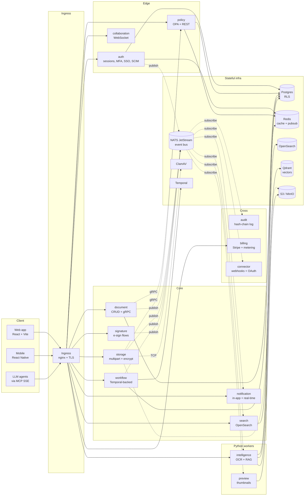
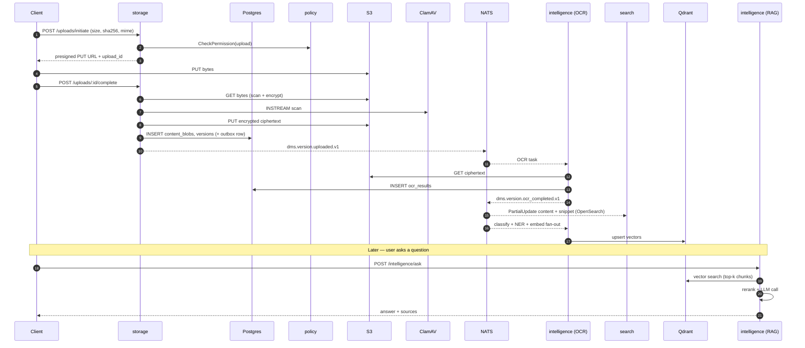

# SeDoc Architecture

Enterprise-DMS reference architecture: 14 services, ~12 infra
components, Postgres RLS for tenant isolation, NATS JetStream as the
platform event bus, OPA for authorization, S3-compatible object
storage with per-blob envelope encryption.

## High-level component diagram



**Two communication modes**

- **Synchronous (gRPC)** for hot-path decisions that can't be deferred:
  `document → policy` permission checks on every read/write,
  `storage → policy` on every upload initiate, `storage → ClamAV`
  for virus scan.
- **Asynchronous (NATS JetStream)** for everything else: state
  propagation (search index, notification fan-out, audit log, connector
  webhooks, AI post-processing). Every write to a domain table pairs
  with an `outbox` row in the **same** DB transaction; a per-service
  publisher polls and forwards to NATS.

## Tenant isolation

All tenant data tables have `tenant_id UUID` as the first column of the
primary key and a Postgres RLS policy:

```sql
USING (tenant_id = current_setting('app.current_tenant', true)::uuid)
```

Every application query runs inside `database.WithTenantTx(tenantID,
...)`, which opens a transaction and issues
`SET LOCAL app.current_tenant = $tenantID`. The app user is created
with `NOBYPASSRLS`, so even a buggy query that omits the tenant
predicate fails-closed (0 rows) rather than leaking cross-tenant data.

## Data flow: upload → OCR → search → AI Q&A



The paired invariants:

- **The outbox row is in the same transaction as the business write.**
  A crash between commit and NATS publish never loses the event — the
  publisher retries until delivery succeeds.
- **Every consumer is RLS-scoped** via its handler-side
  `WithTenantTx(data["tenant_id"])`.
- **correlation-id threads through the whole chain** — header on the
  NATS message, attached to every log line by the consumer middleware.

## Deployment topology

### SaaS (default values.yaml)

- Shared multi-tenant Postgres + Redis + OpenSearch + NATS cluster.
- External S3 (AWS S3 / GCS / Azure Blob).
- KMS-backed KEK (Vault or AWS KMS).
- Temporal shared cluster.
- Ingress: nginx + cert-manager + Let's Encrypt.
- HPA enabled on every service; PDB ensures at least one replica
  during disruptions.
- Observability: Prometheus (ServiceMonitors on `/metrics` port
  8081) + OTLP traces to Tempo.

### On-prem (values-onprem.yaml)

- Everything runs inside the customer cluster.
- S3 replaced with Dell ECS / Ceph / MinIO (S3-compatible).
- Email via on-prem SMTP (no external SendGrid / SES).
- Telemetry export disabled — Prometheus stays in-cluster.
- Ollama for LLM (no external OpenAI traffic).
- Billing service still deployed but Stripe integration is disabled
  (`billing.stripe.enabled: false`).

### Air-gapped (values-airgapped.yaml)

- No outbound internet. Images pre-loaded into an internal registry
  (`imageRegistry` points at it).
- All LLM calls go to on-prem Ollama.
- Audit export runs to a local SIEM (syslog forwarder).
- Licence validation is offline — a signed licence file is mounted
  as a Kubernetes Secret.
- Connector service OAuth callbacks disabled (no Salesforce / Google
  / Microsoft reachability).

## Why these choices

- **RLS + `NOBYPASSRLS` role**: defense-in-depth. Even if application
  code forgets the tenant predicate, Postgres refuses to leak.
- **Transactional outbox over direct NATS publish**: we lived the
  "crash between commit and publish" bug exactly once; outbox
  eliminates the class.
- **Per-blob envelope encryption (DEK wrapped by tenant KEK)**: crypto
  shredding for deletion — drop the KEK and every DEK is unusable,
  every ciphertext is garbage.
- **OPA/Rego for authZ**: the rules are versioned, tested against
  pinned fixtures, and changeable without service restarts.
- **NATS JetStream over Kafka**: lower op overhead at our scale, file
  persistence is enough for 7-day retention, and the subject
  hierarchy matches the `dms.{domain}.{action}.v1` taxonomy cleanly.
- **Temporal for workflows**: approval flows that run for days cannot
  be rolled on top of cron + state columns. Temporal's durable
  execution handles retries, timeouts, and signals natively.

## Related docs

- [SETUP.md](../SETUP.md) — local dev setup
- [docs/audit/remediation/](audit/remediation/) — every post-audit
  remediation pass and the bugs each one fixed
- [docs/api/openapi.yaml](api/openapi.yaml) — REST contract
