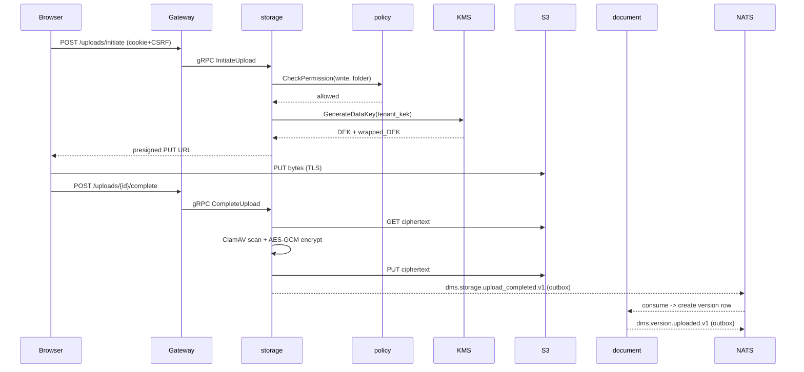
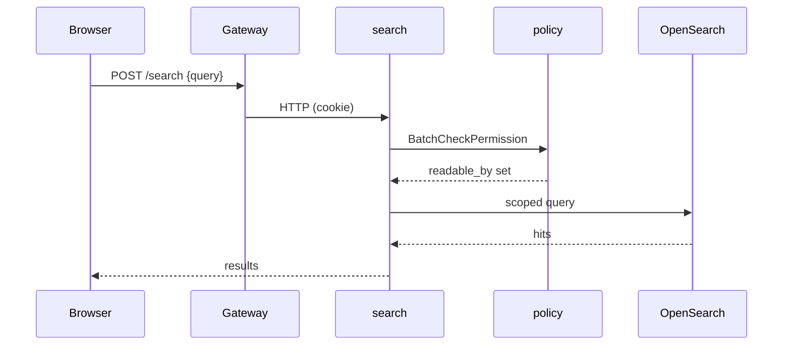
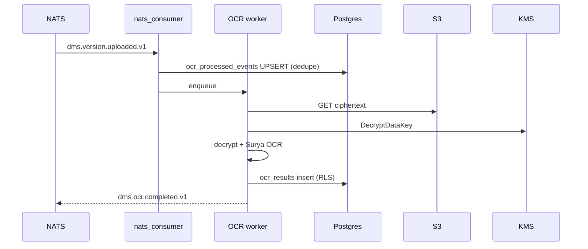
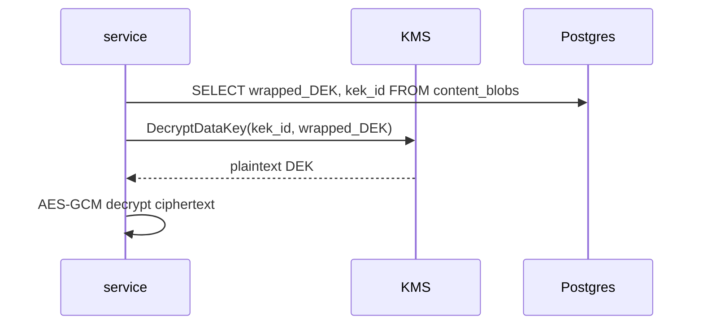
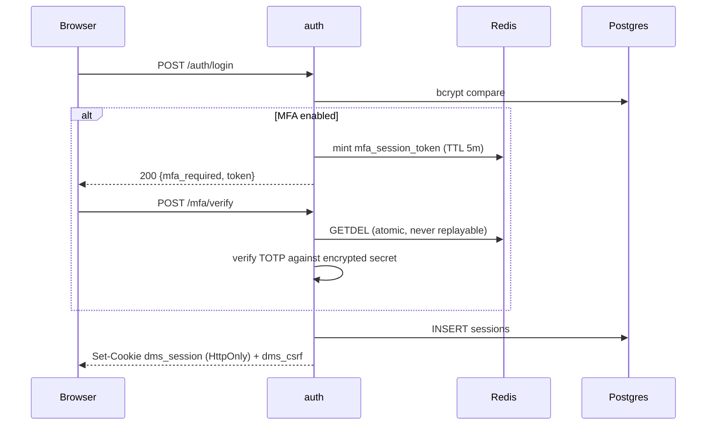

# VaultDMS Threat Model

**Method:** STRIDE per trust boundary.
**Scope:** production SaaS deployment. On-prem variant has a smaller
attack surface; differences called out inline.
**Last reviewed:** 2026-04-18.
**Review cadence:** each major release, or any time a new trust
boundary is introduced.

## Trust boundaries

```
  ┌──────────────┐   TLS   ┌──────────────────┐   mTLS   ┌──────────────┐
  │   Browser    │ ◄─────► │   Edge / WAF     │ ◄──────► │  API gateway │
  └──────────────┘         └──────────────────┘          └──────┬───────┘
                                                                │
                                    ┌───────────────────────────┼──────────────────┐
                                    │                           │                  │
                              ┌─────▼──────┐             ┌──────▼──────┐    ┌──────▼──────┐
                              │  Services  │  NATS/PG    │  Temporal   │    │ Intelligence│
                              │  (Go, 15)  │ ◄─────────► │  workflows  │    │  (Python)   │
                              └─────┬──────┘             └─────────────┘    └─────────────┘
                                    │
             ┌──────────────────────┼─────────────────────┬────────────────────┐
             ▼                      ▼                     ▼                    ▼
        ┌─────────┐          ┌─────────────┐       ┌─────────────┐      ┌─────────────┐
        │Postgres │          │ Object Store│       │  KMS / HSM  │      │   NATS JS   │
        │  + RLS  │          │   (S3)      │       │   (AWS)     │      │             │
        └─────────┘          └─────────────┘       └─────────────┘      └─────────────┘
```

Trust boundaries (where threat modelling focuses):

- **B1** Browser → Edge (TLS termination, WAF, CSRF, rate limit)
- **B2** Edge → API gateway (mTLS, request validation)
- **B3** API gateway → services (mTLS inside mesh)
- **B4** Services ↔ Postgres (RLS + tenant GUC)
- **B5** Services ↔ Object store (per-tenant prefixes, signed URLs)
- **B6** Services ↔ KMS (envelope encryption)
- **B7** Services ↔ External connectors (OAuth, webhook sigs)
- **B8** Admin plane ↔ Control plane (break-glass, audit)

## Threats per boundary (STRIDE)

### B1 — Browser / Edge

| Threat | Category | Mitigation | Residual risk |
|---|---|---|---|
| Session cookie theft via XSS | Tampering / Info | CSP strict, HttpOnly cookies, input sanitation, DOMPurify | Low — any XSS is treated as CVE-P1 |
| CSRF on state-changing POSTs | Tampering | SameSite=Strict + CSRF token on all non-GET | Low |
| Clickjacking | Repudiation | X-Frame-Options: DENY | Low |
| Credential stuffing | Spoofing | Per-account rate limit + CAPTCHA on > 5 failures (Wave 4b) | Medium — botnets with residential IPs bypass IP rate limits |
| Volumetric DDoS | DoS | CloudFront + AWS Shield Standard | Medium — Shield Advanced not subscribed |

### B2/B3 — Edge → API gateway → services

| Threat | Category | Mitigation | Residual risk |
|---|---|---|---|
| Forged inter-service calls | Spoofing | mTLS with short-lived SPIFFE IDs | Low |
| Header injection for tenant spoofing | Elevation | `X-Tenant-ID` is **never** trusted from outside; tenant is derived from session/API key | Low |
| Request smuggling | Tampering | HTTP/2 only, Envoy validates CL/TE | Low |
| Token replay | Spoofing | Session tokens bound to client IP + UA fingerprint (soft) + 24h TTL | Low |

### B4 — Services ↔ Postgres

| Threat | Category | Mitigation | Residual risk |
|---|---|---|---|
| Cross-tenant data access via ORM bug | Elevation | Row-level security; `app.current_tenant` GUC set per connection; connection cannot escape tenant scope | Low — enforced in DB, not app |
| SQL injection | Tampering | pgx parameterised queries; CI semgrep rule forbids `fmt.Sprintf` to SQL | Low |
| RLS policy bypass via superuser role | Elevation | App role is **never** superuser; migrations run with a separate DDL role | Low |
| Data-at-rest theft | Info | Postgres encrypted at EBS layer; KEK in KMS; backups also encrypted | Low |
| Connection pool exhausted (DoS) | DoS | Per-tenant connection quotas via pgbouncer; idle timeout; circuit breaker | Medium — noisy tenant still degrades others until quota trips |

### B5 — Object store

| Threat | Category | Mitigation | Residual risk |
|---|---|---|---|
| Cross-tenant blob access via key guessing | Info | Object keys are `tenant/{uuid}/{uuid}` — unguessable | Low |
| Presigned URL leaked | Info | TTL 15 min; URL binds to HTTP verb + path + content-length | Medium — URL is a bearer token until expiry |
| Blob tampering | Tampering | Envelope encryption; AES-GCM tag failure = hard 500 with audit event | Low |
| Malware upload | Tampering | ClamAV scan on ingest; quarantine bucket on hit (Wave 12) | Medium — zero-day malware |
| Accidental bucket deletion | DoS | S3 bucket MFA delete + object versioning + cross-region replication | Low |

### B6 — KMS / envelope encryption

| Threat | Category | Mitigation | Residual risk |
|---|---|---|---|
| KEK compromise | Info / Elevation | Multi-region KMS CMK; deletion has 30d window; audit trail per decrypt | Low |
| DEK leak in logs | Info | DEKs never logged; zeroise on free; lint rule forbids `log` of `[]byte` named `dek` or `key` | Low |
| KMS region outage | DoS | Multi-region key replicas | Low |
| Tenant-level key rotation fails half-way | Tampering / Integrity | Rewrap workflow is idempotent + resumable (Wave 12.3) | Low |

### B7 — External connectors

| Threat | Category | Mitigation | Residual risk |
|---|---|---|---|
| Forged webhook from spoofed source | Spoofing | HMAC signature required; replay window ≤ 5 min | Low |
| OAuth token theft (Google/Microsoft connectors) | Info | Tokens encrypted with per-tenant KEK in `connector_credentials` | Low |
| Third-party SaaS compromised | Info | Blast radius limited to what the connector scopes grant; credentials can be revoked per tenant | Medium — by definition out of our control |
| SSRF via connector-initiated fetch | Tampering | Egress via dedicated proxy with allow-list of provider domains | Low |

### B8 — Admin plane

| Threat | Category | Mitigation | Residual risk |
|---|---|---|---|
| Break-glass abuse | Elevation | Every break-glass session is audit-logged to an append-only store; quarterly review | Low |
| Admin credential phishing | Spoofing | Hardware-backed MFA required for admin role | Low |
| Audit-log tampering | Repudiation | Audit writes go to an append-only table with monthly checksum attestation | Low |
| Insider data exfiltration | Info | DLP on admin query results >1000 rows; per-tenant data access is logged and alertable | Medium — inherent to any privileged role |

### B9 — Wave 15 additions (acknowledgement, geofence, password-policy, saved-signature)

| Threat | Category | Mitigation | Residual risk |
|---|---|---|---|
| **Acknowledgement spoofing** — attacker forges an "I acknowledged" row for a user they don't control. | Spoofing + Repudiation | Per-assignment `HMAC-SHA256(tenant_signing_key, campaign_id ‖ user_id ‖ RFC3339Nano(ack_at))`, with the tenant signing key KMS-wrapped at rest (ADR 0027). Row-deletion or timestamp-edit both break the HMAC. Paired per-campaign hash chain over `acknowledgement_events` means silent row removal is detectable on export. | Low — attacker needs both a DB write AND the tenant signing key to forge a plausible attestation. |
| **Geofence bypass via residential proxy / VPN.** | Tampering (of source IP attestation) | Enforcement honours the right-most trusted-proxy `X-Forwarded-For` hop, not client-controlled headers. Kong/ALB trusted-IP list is the trust boundary. For high-risk actions, `mode=step_up` triggers re-MFA instead of an outright allow, so a bypass still loses to the MFA challenge. MaxMind detects most common VPN ranges once the adapter ships (ADR 0028). | Medium — residential proxies are hard to fingerprint. Mitigation is defence-in-depth (step_up + role checks + rate limit), not a single control. |
| **Password-reset abuse** — admin or stolen admin token floods `force-password-reset` to lock users out. | DoS of user availability + Elevation-of-privilege if chained. | `force-password-reset` is owner/admin-role gated via OPA; self-target is rejected (admin can't lock themselves via the admin surface); every invocation emits `dms.auth.password_reset_requested.v1` for SOC monitoring; one-time change token is single-use with 10-minute TTL and Redis `GETDEL` so replay is impossible. | Low — remains a valid target of compromised-admin playbooks; incident response covers it. |
| **Saved-signature theft** — attacker exfiltrates a user's signature image and uses it to visually forge a signed PDF. | Info disclosure → Spoofing (at the "looks-signed" layer, not the cryptographic layer) | Image bytes encrypted at rest with a **per-profile** DEK KMS-wrapped under the tenant KEK (ADR 0030); delete is crypto-shred; the signing backend NEVER trusts client-provided pixels — it fetches the bytes server-side by `profile_id`. The cryptographic PAdES signature is produced by the signer cert, which is unaffected by profile theft. | Low — a stolen image lets an attacker forge the *appearance* but not the *cryptographic* signature; signature validators that check the embedded cert chain detect the forgery. |

## Known-issues register

Items we know about, have decided not to fix right now, and are
tracking:

| ID | Issue | Severity | Why not fixed | Tracking |
|---|---|---|---|---|
| KI-01 | Presigned URLs are bearer tokens until expiry | Medium | 15m TTL + HTTPS means exposure window is narrow | Backlog (short-TTL with silent re-sign at service layer) |
| KI-02 | No Shield Advanced subscription | Medium | Cost/benefit for current traffic shape | Reassess at 10× traffic |
| KI-03 | Intelligence service (Python) has weaker mTLS enforcement than Go services | Medium | Istio sidecar injection not yet on Python pods | Wave 14.5 packaging work |
| KI-04 | No per-tenant rate limit on search (only global) | Low | Search is read-only, OpenSearch circuit breaks under load | Backlog |
| KI-05 | Temporal UI auth is basic-auth behind the bastion | Low | Bastion + MFA gates reach the UI | Wave 14.6 release-engineering |

Every item has an ID so PRs and pentest findings can reference it
without ambiguity.

## Pentest engagement plan

Spec §14.4: "Third-party pentest before GA. Remediation SLA by
severity."

### Scope for first engagement

- External attack surface: `https://app.vaultdms.io`, `https://api.vaultdms.io`,
  `https://auth.vaultdms.io/saml/*`, `https://auth.vaultdms.io/oidc/*`.
- Authenticated scope: 2 tenants provided, 2 users each (one admin,
  one member). Tester should attempt cross-tenant access.
- API keys provided for one tenant.
- SCIM endpoint (`/scim/v2/{tenant}/...`) — in scope.
- Connectors (Google, Microsoft): OAuth callback + webhook receivers
  in scope; the third-party providers themselves are out of scope.

### Out of scope

- Physical security.
- Social engineering of Raabyt staff.
- DoS / volumetric load testing (we run our own — see Wave 13.2).
- Third-party-hosted services (AWS, Stripe, Twilio).

### Remediation SLA

| Severity | Definition | SLA |
|---|---|---|
| Critical | RCE, auth bypass, cross-tenant data access, key extraction | Patch + deploy within **72h** |
| High | AuthZ bypass within a tenant, SQLi, stored XSS | Within **2 weeks** |
| Medium | Information disclosure bounded to one tenant, CSRF on low-impact endpoint, rate-limit bypass | Within **30 days** |
| Low | Missing headers, verbose errors, cosmetic | **Next minor release** |
| Informational | Hardening recommendations | Backlog; re-evaluate per release |

### Retest

A finding is not closed until the pentester has retested and signed
off. Retest is included in the engagement contract. Every Critical
and High finding gets a dedicated retest; Medium/Low retested in
batch.

### Disclosure

Critical findings with customer data impact trigger the disclosure
playbook (separate doc, Wave 14.4b). Non-data-impact Criticals are
disclosed in the next release notes with mitigation summary, no
technical details until >80% of tenants are on the patched version.

## Data-flow diagrams per critical operation

Each diagram traces a single user-initiated operation across trust boundaries.

### DFD-1 — Document upload



STRIDE: **T/E** at B1–B2 CSRF guards mutations; **I** presigned PUT is 5m TTL + single-PUT scoped; infected bytes COPY to quarantine, never decrypted for download.

### DFD-2 — Search query



STRIDE: **I** every hit is post-filtered by `readable_by`; invariant tested in `tests/load/scenarios/07-cross-tenant-isolation.js` (zero-violations assertion).

### DFD-3 — OCR pipeline



STRIDE: **T** dedupe PK `(tenant_id, event_id)` makes retries idempotent; **I** plaintext lives in-memory only in the worker.

### DFD-4 — KMS envelope unwrap



STRIDE: **S** KMS auth by IAM/AppRole — stolen service cert unwraps ANY tenant's DEK; **T** wrong-alias unwrap fails (regression-tested as `TestLocalKM_DecryptUnderWrongAliasFails`).

### DFD-5 — Login with MFA



STRIDE: **S** bcrypt cost 12 + constant-time compare; **T** `mfa_session_token` is single-use via Redis GETDEL; **I** `dms_session` HttpOnly+SameSite=Strict; `dms_csrf` useless alone (double-submit check).

## Approvals

Threat model must be signed before pilot launch. Rows stay blank until a reviewer has walked the full document end-to-end.

| Role | Name | Date | Signature |
|---|---|---|---|
| Security lead | _TBD_ | | |
| Platform engineering lead | _TBD_ | | |
| CTO | _TBD_ | | |

## Pointers

- Auth deep-dive: [docs/runbooks/06-session-cookies-csrf.md](../runbooks/06-session-cookies-csrf.md)
- KMS / envelope: [docs/runbooks/06-key-management.md](../runbooks/06-key-management.md)
- SAST / SCA in CI: `.github/workflows/ci.yml` → `security-go`, `security-semgrep`, `security-trivy`, `security-npm`, `security-python`, gated by `security-gate`
- Mutation tests on security code: `scripts/mutesting/README.md`
- Pentest findings folder: `docs/security/pentest-findings/` (one file per finding, named `PT-YYYY-NNN.md`, using `pentest-finding-TEMPLATE.md`)
