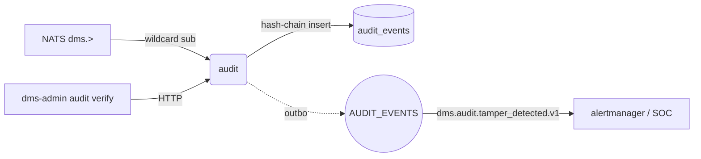

# audit

Tamper-evident audit log with SHA-256 hash-chain integrity + GDPR
data-subject tooling.

## Responsibilities

- Subscribe to `dms.>` wildcard, turn every envelope into an
  `audit_events` row.
- Hash-chain each row (`event_hash = SHA256(prev|tenant|actor|action|resource|ts)`).
- Per-tenant lock (in-process mutex + Redis SETNX) serializes writes
  so the chain stays monotonic.
- Verify integrity on demand (walks the chain, reports first break).
- GDPR data-subject export + anonymize.

## API surface

REST:

- `GET /api/v1/audit/events` — paginated list
- `GET /api/v1/audit/export` — CSV download
- `POST /api/v1/audit/verify-integrity`
- `POST /api/v1/audit/data-subject/export`
- `POST /api/v1/audit/data-subject/anonymize`

NATS: consumer only — `dms.>` with durable name `audit-all`.

## Dependencies

- **Postgres** table `audit_events` (partitioned by month).
- **Redis**: tenant lock keys `audit_lock:{tenantID}`.
- **NATS** stream `AUDIT` (plus cross-stream consumer over `dms.>`).

## Configuration

`VAULTDMS_DATABASE_URL`, `_REDIS_URL`, `_NATS_URL`,
`_HTTP_PORT` (8080), `_HEALTH_PORT` (8081). Service has no gRPC.

## Running locally

```bash
make up
( cd services/audit && go run ./cmd/server )
```

## Testing

```bash
go test ./services/audit/...
```

## Deployment

`deploy/helm/vaultdms/templates/audit/` — full 6-resource set (used
as the reference template for every other Go service).

## Metrics

- `http_requests_total{path=/api/v1/audit/events}`
- `event_bus_consumed_total{topic=dms.*}` — ingest throughput

## Troubleshooting

**Integrity verify reports a break** — the chain is only broken if a
row was directly edited in SQL. The `BrokenAt` field names the first
suspect event; investigate via `psql` + git history.

**Queue lag rising** — the NATS consumer is single-threaded per
tenant by design (for hash-chain ordering). Scale out replicas — the
per-tenant lock ensures ordering across instances.

## Architecture



## Env var reference

| Var | Purpose |
|---|---|
| `VAULTDMS_DATABASE_URL` | audit_events + outbox |
| `VAULTDMS_REDIS_URL` | per-tenant hash-chain lock |
| `VAULTDMS_NATS_URL` | `dms.>` subscribe + outbox publish |
| `VAULTDMS_HTTP_PORT` (8080) / `VAULTDMS_HEALTH_PORT` (8081) | service ports |

## On-call

Hash-chain break → `audit_chain_break_total` counter + `dms.audit.tamper_detected.v1` outbox event. Related: [runbook 12 — secret rotation](../../docs/runbooks/12-secret-rotation.md).
