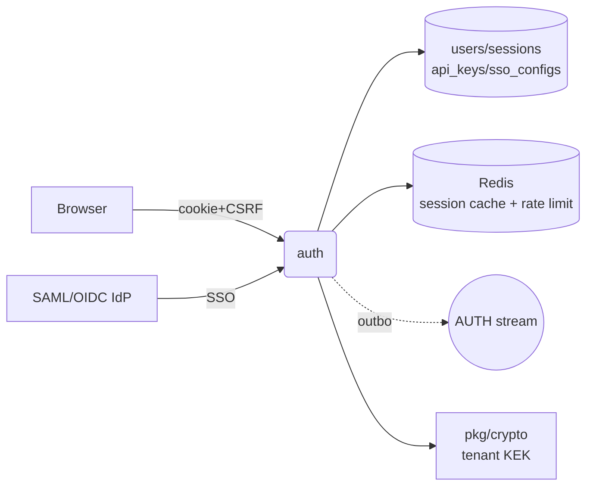

# auth

Session-cookie authentication, user registration, MFA (TOTP), API keys,
SAML + OIDC SSO, SCIM provisioning.

## Responsibilities

- Issue and validate session cookies (HttpOnly, SameSite=Strict,
  bcrypt cost 12).
- TOTP enrollment + step-up verification; AES-GCM-encrypted MFA
  secrets with per-tenant KEK.
- API keys (`vdms_` prefix, scoped, bcrypt-hashed).
- SAML 2.0 SP + OIDC relying-party; auto-provision users on first
  SSO assertion.
- SCIM v2 `/scim/v2/{tenant_slug}/*` for bulk user lifecycle.
- Admin endpoints for tenant-level user management (list, invite,
  suspend, reset-MFA) — see 04b remediation.

## API surface

REST under `/api/v1/auth`: `register`, `login`, `logout`,
`mfa/{setup,confirm,disable,verify,recovery}`, `sessions/*`,
`api-keys/*`, `saml/{tenant}/{metadata,login,acs}`,
`oidc/{tenant}/{login,callback}`.

Admin: `/api/v1/admin/users`, `.../invite`, `.../{id}/suspend`,
`.../{id}/reset-mfa`.

SCIM: `/scim/v2/{tenant_slug}/Users`, `.../Groups`.

NATS publishes (via outbox):

- `dms.auth.user_registered.v1`
- `dms.auth.login_success.v1` / `.login_failed.v1`
- `dms.auth.mfa_enabled.v1` / `.mfa_disabled.v1`
- `dms.user.invited.v1` / `.suspended.v1` / `.mfa_reset.v1`

## Dependencies

- **Postgres** tables: `users`, `sessions`, `api_keys`, `sso_configs`,
  `outbox`.
- **Redis**: tenant-prefixed session cache
  (`session:{tenantID}:{hash}`), login-attempt counters, MFA session
  tokens.
- **NATS** JetStream stream `AUTH`.

## Configuration

`VAULTDMS_DATABASE_URL`, `_REDIS_URL`, `_NATS_URL`, `_LOCAL_KEK`
(base64 32-byte KEK for MFA secrets), `_PUBLIC_URL` (for SSO
redirects + share links), `SESSION_COOKIE_SECRET`, `_HTTP_PORT`
(default 8080).

## Running locally

```bash
make setup       # full stack
# or, host-only:
make up
( cd services/auth && VAULTDMS_HTTP_PORT=8081 go run ./cmd/server )
```

## Testing

```bash
make test-services
go test ./services/auth/...
```

## Deployment

Helm: `deploy/helm/vaultdms/templates/auth/` (full 6-resource set).

## Metrics

- `http_requests_total{path=/api/v1/auth/*}` — login success/failure rates
- `ocr_processing_seconds` is NOT here — that's intelligence
- auth-specific: login rate-limit hits (via Redis key counters)

## Troubleshooting

**Login returns 500, log says `invalid input syntax for type inet: "[::1]"`**
— IPv6 loopback. Fixed in `clientMeta` to use `net.SplitHostPort`
(remediation 04b live-run).

**Login returns 401 "tenant required" before credentials are checked**
— `RateLimitHTTP` used to require tenant on pre-auth paths. Now
no-ops when no tenant is on ctx (remediation 04b live-run).

**MFA setup fails with "KEK unavailable"**
— `VAULTDMS_LOCAL_KEK` not set and no KMS configured. Generate:
`openssl rand -base64 32`.

## Architecture



## Env var reference

| Var | Purpose |
|---|---|
| `VAULTDMS_DATABASE_URL` | users + sessions + outbox |
| `VAULTDMS_REDIS_URL` | session cache + login rate limit |
| `VAULTDMS_NATS_URL` | outbox publish |
| `VAULTDMS_LOCAL_KEK` | base64 32-byte KEK for MFA secret encryption |
| `SESSION_COOKIE_SECRET` | HMAC of session cookies |
| `VAULTDMS_PUBLIC_URL` | SAML/OIDC redirect base |
| `VAULTDMS_HTTP_PORT` (8080) | service port |

## On-call

- [runbook 06 — session cookies + CSRF](../../docs/runbooks/06-session-cookies-csrf.md)
- [runbook 12 — secret rotation](../../docs/runbooks/12-secret-rotation.md) (JWT signing key + api-internal tokens pass through auth)
- [runbook 06 — key management](../../docs/runbooks/06-key-management.md) (MFA secret KEK)
