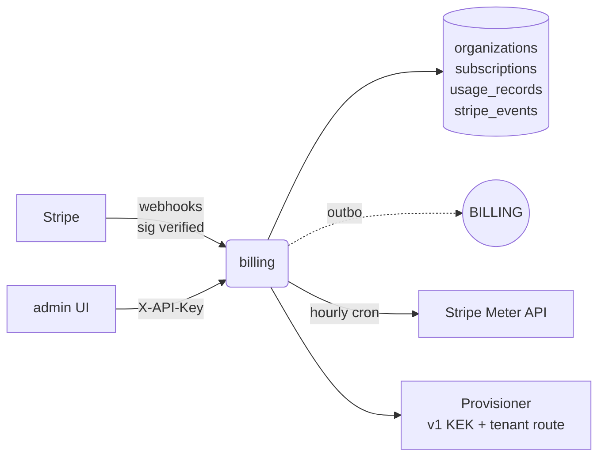

# billing

Tenant provisioning, Stripe subscriptions, usage metering, per-tenant
feature flags.

## Responsibilities

- Provision a new org (create `organizations` row, seed default
  workspace, invite admin user).
- Stripe webhook verification + subscription-state machine
  (active → past_due → suspended/cancelled).
- Hourly usage metering cron: aggregates storage, OCR pages, API
  calls, AI tokens into `usage_records`.
- Feature-flag read/write, both internal (X-API-Key) and user-facing
  (session + owner role).
- Grace-period enforcer: suspends tenants past their grace window.

## API surface

REST:

- `POST /internal/v1/tenants/provision` (X-API-Key)
- `POST /internal/v1/stripe/webhook` (Stripe signature verify)
- `GET/PUT /internal/v1/tenants/{tenantId}/features` (X-API-Key)
- `GET /internal/v1/tenants/{tenantId}/subscription` (X-API-Key)
- `GET /internal/v1/plans` (X-API-Key)
- `GET/PUT /api/v1/admin/settings` (session + owner role — 04b)

## Dependencies

- **Postgres** tables: `organizations`, `subscriptions`, `usage_records`,
  `invoices`, `feature_flags`.
- **Stripe API** (only when enabled; webhook secret required in prod).
- **Redis**: rate limit + provisioning idempotency keys.

## Configuration

`VAULTDMS_INTERNAL_API_KEY` (required for `/internal/v1`),
`STRIPE_WEBHOOK_SECRET` (required in prod when billing active),
standard DB/Redis/NATS URLs.

## Running locally

```bash
make up
( cd services/billing && VAULTDMS_HTTP_PORT=8083 go run ./cmd/server )
```

## Testing

```bash
make test-billing
```

## Deployment

`deploy/helm/vaultdms/templates/billing/` — full 6-resource set.

## Metrics

- `http_requests_total{path=/internal/v1/*}` — Stripe webhook traffic
- `event_bus_published_total{topic=dms.billing.*}`
- Stripe-specific counters via the stripe-go SDK

## Troubleshooting

**Metering cron errors: `relation "usage_records" does not exist`** —
the `usage_records` table isn't in `000001_initial_schema.up.sql`.
Pre-existing bug; the cron fails open (logs + continues) until a
future migration adds the table.

**Stripe webhook returns 401** — signature verification failed. Check
`STRIPE_WEBHOOK_SECRET` matches the secret in the Stripe dashboard
for the endpoint.

**Provisioned tenant can't log in** — the admin user row was created
but no password was set. Send the invite email (via the outbox event)
or run `dms-admin provision --reset-password`.

**Metering shows 0 for every tenant** — fixed 2026-04-20. The
metering queries ran without `app.current_tenant` GUC set, so RLS
returned 0 rows silently. Every query now wraps in `WithTenantTx`.

## Architecture



## Env var reference

| Var | Purpose |
|---|---|
| `VAULTDMS_DATABASE_URL` | org/sub/usage/outbox |
| `VAULTDMS_REDIS_URL` | tenant route cache + idempotency |
| `VAULTDMS_NATS_URL` | outbox publish |
| `VAULTDMS_INTERNAL_API_KEY` | gate on `/internal/v1/*` |
| `STRIPE_WEBHOOK_SECRET` | verify inbound webhooks |
| `STRIPE_API_KEY` | outbound Stripe Meter push (soft no-op when unset) |

## On-call

- [runbook 13 — control plane](../../docs/runbooks/13-control-plane.md) (provisioning, Stripe webhooks, tenant lifecycle, usage metering)
