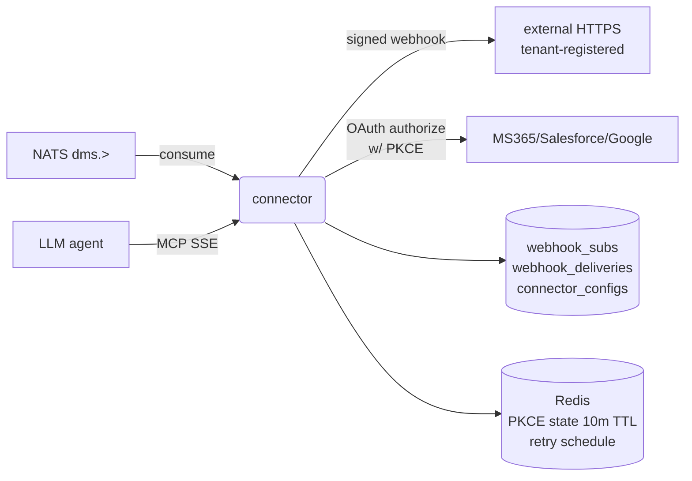

# connector

Outbound webhooks, third-party OAuth (Salesforce / Google / Microsoft),
MCP (Model Context Protocol) SSE endpoint for LLM agents.

## Responsibilities

- Webhook subscription CRUD — tenants register HTTPS endpoints + events.
- Fan out every `dms.>` event to matching webhook subscriptions;
  sign payload with per-subscription HMAC + timestamp.
- Retry failed deliveries with exponential backoff; mark each attempt
  in the `webhook_deliveries` log.
- OAuth authorization + callback flows for Salesforce, Google,
  Microsoft (attach to Case, Drive, SharePoint).
- MCP SSE server for LLM agents to stream document queries.

## API surface

REST:

- `POST/GET /api/v1/webhooks` — create / list
- `DELETE /api/v1/webhooks/{id}`
- `GET /api/v1/webhooks/{id}/deliveries`
- `GET /api/v1/connectors` + `.../{provider}` + `.../auth-url` + `.../callback`
- `POST /api/v1/mcp` — SSE endpoint

NATS consumer (durable `connector-fanout`): `dms.>` wildcard for
webhook delivery.

## Dependencies

- **Postgres** tables: `webhook_subscriptions`, `webhook_deliveries`,
  `connector_configs`.
- **Redis**: retry-schedule keys.
- **outbound HTTPS** to subscriber URLs (SSRF-guarded — see
  `webhook.ValidateURL`).

## Configuration

Standard DB/Redis/NATS. No connector-specific env; per-tenant Stripe /
OAuth client credentials live in `connector_configs` rows.

## Running locally

```bash
make up
( cd services/connector && VAULTDMS_HTTP_PORT=8084 go run ./cmd/server )
```

## Testing

```bash
make test-connector
```

## Deployment

`deploy/helm/vaultdms/templates/connector/` — full 6-resource set.

## Metrics

- `event_bus_consumed_total{topic=dms.*}` — delivery queue pressure
- `http_requests_total{path=/api/v1/webhooks*}`
- Custom: `webhook_delivery_total{result=ok|failed|retried}`

## Troubleshooting

**Webhook deliveries all 5xx at the receiver** — look at
`webhook_deliveries.last_error`. If the receiver rejects the
signature, its SDK may be locking to a specific version; our format
is `sha256=hex(HMAC(timestamp.payload, secret))`.

**SSRF rejection on valid URL** — `ValidateURL` refuses private /
loopback / link-local IPs. If the receiver is genuinely private, it
has to run outside the cluster.

## Architecture



## Env var reference

| Var | Purpose |
|---|---|
| `VAULTDMS_DATABASE_URL` | subs/deliveries/configs |
| `VAULTDMS_REDIS_URL` | PKCE state + retry schedule |
| `VAULTDMS_NATS_URL` | `dms.>` wildcard consume |
| `M365_CLIENT_ID` / `M365_CLIENT_SECRET` / `M365_TENANT_ID` | OAuth app |
| `SALESFORCE_CLIENT_ID` / `_SECRET` / `_INSTANCE_URL` | OAuth app |
| `GOOGLE_CLIENT_ID` / `_SECRET` | OAuth app |

Empty OAuth vars register the provider with misconfig — auth-url calls return a clear error rather than "unknown provider".

## On-call

No dedicated runbook. Webhook delivery issues: inspect `webhook_deliveries.last_error`. OAuth issues: verify PKCE state expiry (10-min Redis TTL) and that the callback path matches the registered redirect URI.
