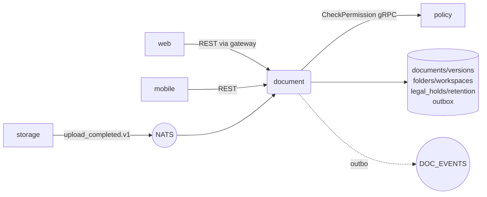

# document

The core DMS service: documents, versions, folders, workspaces,
metadata, tags, lifecycle, legal holds.

## Responsibilities

- gRPC CRUD for documents + versions + folders + workspaces.
- Lifecycle state machine: `draft → in_review → active → superseded
  → retained → archived → disposed`; `legal_hold` freezes any
  lifecycle transition.
- Region pin immutability after first upload.
- Compliance: retention policies, legal holds, deletion holds.
- Permission propagation to policy service.

## API surface

gRPC (primary — served with grpc-gateway for REST pass-through):

- `DocumentService.CreateDocument` / `Get` / `List` / `Patch` /
  `SoftDelete` / `Restore` / `SetLifecycle` / `ApplyHold` / `ReleaseHold`
- `WorkspaceService.Create` / `List` / `ListFolders`

NATS publishes (via outbox): `dms.document.created.v1`,
`.updated.v1`, `.deleted.v1`, `.lifecycle_changed.v1`,
`.legal_hold_applied.v1`, `.version.uploaded.v1`.

## Dependencies

- **Postgres** (45-table schema lives in
  `services/document/migrations`): `documents`, `versions`, `folders`,
  `workspaces`, `workspace_members`, `permissions`, `legal_holds`,
  `retention_policies`, `outbox`, …
- **policy service** (gRPC client) for permission checks.
- **NATS** stream `DOCUMENTS`.

## Configuration

`VAULTDMS_DATABASE_URL`, `_REDIS_URL`, `_NATS_URL`,
`POLICY_SERVICE_ADDR` (default `policy:9090`), `_HTTP_PORT`,
`_GRPC_PORT`, `_HEALTH_PORT`.

## Running locally

```bash
make up
make migrate             # 000001_initial_schema.up.sql (~45 tables)
( cd services/document && go run ./cmd/server )
```

## Testing

```bash
go test ./services/document/...
# Integration (testcontainers):
go test -tags integration ./services/document/...
```

## Deployment

`deploy/helm/vaultdms/templates/document/` — full 6-resource set.

## Metrics

- `http_requests_total{path=/api/v1/documents*}` + gRPC equivalents
- `db_query_duration_seconds{query=list_documents|patch_document|...}`

## Troubleshooting

**500 on CreateDocument** — most commonly the `folder_id` doesn't
exist or belongs to a different tenant; RLS returns 0 rows and the
handler reports "folder not found".

**Region pin rejected** — once set, region_pin is immutable. The
service returns `region_pin: immutable` validation errors. To
physically move a doc across regions use the compliance migration
tool, not a PATCH.

## Architecture



Per ADR 0021, `dms.version.uploaded.v1` is emitted here (not from storage). Outbox lands in the same tx as the version-row insert.

## Env var reference

| Var | Purpose |
|---|---|
| `VAULTDMS_DATABASE_URL` | 45-table doc schema + outbox |
| `VAULTDMS_REDIS_URL` | tenant route cache |
| `VAULTDMS_NATS_URL` | outbox publish |
| `POLICY_SERVICE_ADDR` | gRPC permission checks (default `policy:9090`) |
| `VAULTDMS_HTTP_PORT` / `_GRPC_PORT` / `_HEALTH_PORT` | service ports |

## On-call

- [runbook 08 — retention](../../docs/runbooks/08-retention.md) (lifecycle state machine, legal holds)
- [runbook 13 — control plane](../../docs/runbooks/13-control-plane.md) (hard-dispose activity retires KEKs + marks org disposed)
