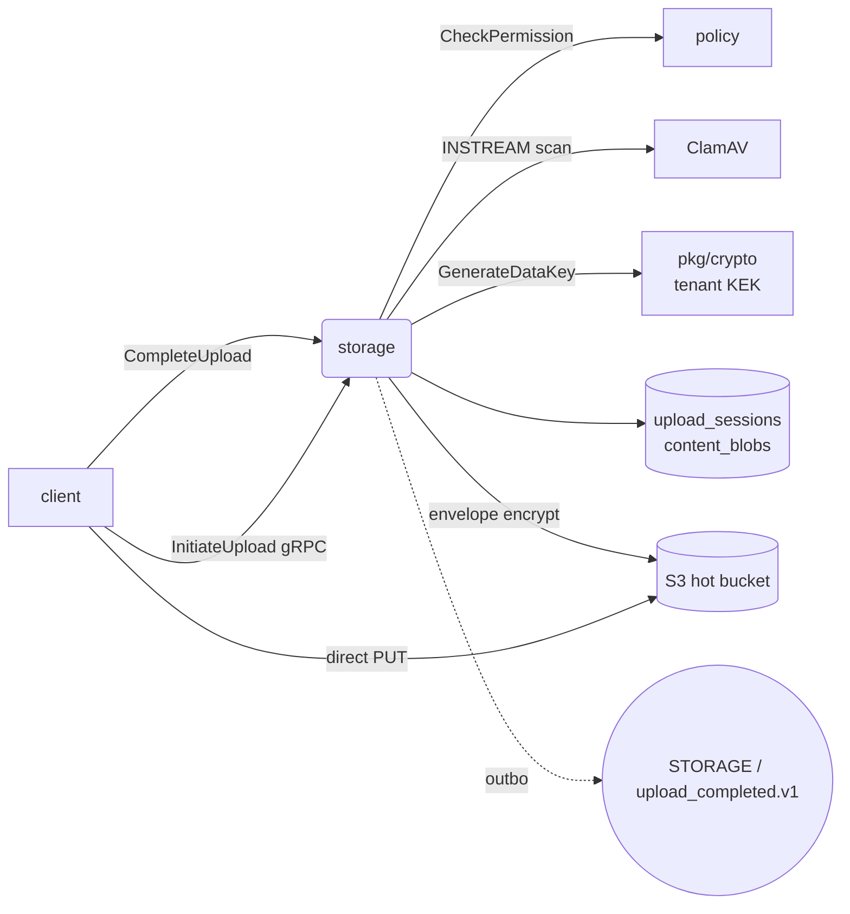

# storage

Multipart upload orchestration, S3 object storage, per-file envelope
encryption (AES-GCM), ClamAV scan, lifecycle tier transitions.

## Responsibilities

- Initiate / complete / abort multipart uploads; return presigned PUT
  URLs to clients.
- Enforce plan-based upload-size limits (queried from billing).
- Stream-hash uploads with SHA-256; reject mismatches between
  client-declared and computed hash.
- Deduplicate — identical SHA-256 in same tenant + region reuses the
  existing `content_blobs` row.
- AES-GCM envelope encrypt every blob with a DEK wrapped by the
  tenant KEK (LocalKeyManager / Vault / AWS KMS).
- ClamAV INSTREAM scan before finalizing; quarantine on hit.
- Tier reaper: age-based transitions from `hot → warm → archive`.

## API surface

gRPC:

- `StorageService.InitiateUpload` / `CompleteUpload` / `AbortUpload`
- `.GetDownloadURL` (presigned GET, 5-minute expiry)
- `.GetScanStatus`
- `.GetPreviewURL`, `.RequestLifecycle` (stubs)

## Dependencies

- **Postgres** tables: `upload_sessions`, `content_blobs`, `versions`.
- **S3** (MinIO dev, AWS/ECS prod): hot/warm/archive/quarantine buckets.
- **policy service** (gRPC) for every upload check.
- **ClamAV** at `CLAMAV_ADDR` (tcp/3310) — INSTREAM protocol.
- **pkg/crypto KeyManager**.

## Configuration

- `VAULTDMS_S3_ENDPOINT` / `_S3_ACCESS_KEY` / `_S3_SECRET_KEY` / `_S3_USE_SSL`
- `CLAMAV_ADDR` (default `clamav:3310`)
- `POLICY_SERVICE_ADDR`
- `VAULTDMS_LOCAL_KEK` (base64 32 bytes, when KMS=local)
- `VAULTDMS_KMS_PROVIDER` (`local | vault | aws`)

## Running locally

```bash
make setup       # ensures MinIO buckets + ClamAV are up
( cd services/storage && go run ./cmd/server )
```

## Testing

```bash
go test ./services/storage/...
# Scanner package has the highest coverage (46%)
```

## Deployment

`deploy/helm/vaultdms/templates/storage/` — full 6-resource set.

## Metrics

- `upload_bytes_total` / `download_bytes_total`
- `db_query_duration_seconds{query=dedup_lookup|insert_blob}`
- ClamAV-specific: `clamav_scan_duration_seconds` histogram
- Storage tier transitions: `tier_transition_total{from,to}`

## Troubleshooting

**Upload fails with "virus detected"** — the stream hit a ClamAV
signature. The blob lands in the quarantine bucket. To inspect,
download via `mc cp local/dms-quarantine/... /tmp/` and analyze.

**Dedup not working** — two uploads with the same hash should produce
one `content_blobs` row. If you see duplicates, check that
`MINIO_USE_SSL` matches between the S3 client and server (TLS mismatch
silently triggers re-upload).

**"clamav unparseable response"** — protocol out of sync with clamd.
Pre-existing case: newer clamd versions may add a trailing NUL we
don't strip. The `parse()` function is pinned by
[05 remediation tests](../../docs/audit/remediation/05-go-service-tests.md).

**MinIO unhealthy** — image ships without `curl`. The healthcheck
fallback uses bash `/dev/tcp` — fixed in the compose file after the
04b live run.

## Architecture



ADR 0021: `dms.version.uploaded.v1` is emitted by the **document** service, not here. Storage emits `upload_completed.v1`; document consumes that and creates the version row → emits version.uploaded.

## Env var reference

| Var | Purpose |
|---|---|
| `VAULTDMS_DATABASE_URL` | upload_sessions + content_blobs |
| `VAULTDMS_S3_ENDPOINT` / `_S3_ACCESS_KEY` / `_S3_SECRET_KEY` / `_S3_USE_SSL` | object store |
| `CLAMAV_ADDR` (3310) | INSTREAM virus scan |
| `POLICY_SERVICE_ADDR` | permission check on every upload |
| `VAULTDMS_LOCAL_KEK` | base64 32-byte master (local KMS) |
| `VAULTDMS_KMS_PROVIDER` | `local \| vault \| aws` |

## On-call

- [runbook 06 — key management](../../docs/runbooks/06-key-management.md) (per-tenant KEK wrapping of every DEK)
