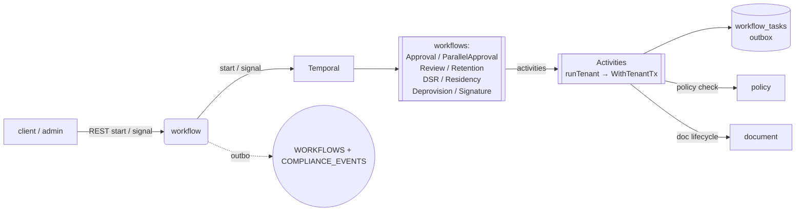

# workflow

Approval workflows on documents, backed by Temporal. Every approval
step is a durable activity; signals drive state transitions.

## Responsibilities

- Register `ApprovalWorkflow` + `ParallelApprovalWorkflow` on a
  Temporal worker.
- REST + Temporal activity pairs for task create / complete /
  delegate / notify / set-lifecycle / publish-event / evaluate-expr.
- Notify assignees through the outbox (see
  [03c remediation](../../docs/audit/remediation/03c-middleware-outbox.md)).
- Conditional branches via `expr-lang`.

## API surface

REST:

- `GET/POST /api/v1/workflows/definitions`
- `POST /api/v1/workflows/instances` — start
- `GET /api/v1/workflows/instances/{id}`
- `POST /api/v1/workflows/instances/{id}/signal` — approve/reject/delegate
- `POST /api/v1/workflows/instances/{id}/cancel`
- `GET /api/v1/workflows/tasks/mine`

Temporal task queue: `vaultdms-workflow`.

Outbox publishes:

- `dms.notify.workflow_assigned.v1`
- `dms.workflow.completed.v1`

## Dependencies

- **Temporal** server at `TEMPORAL_ADDR`.
- **Postgres** tables: `workflow_definitions`, `workflow_instances`,
  `workflow_tasks`, `outbox`.
- **NATS** stream `WORKFLOWS` (via outbox publisher).
- **document service** (activity calls `SetDocumentLifecycle`).

## Configuration

`VAULTDMS_DATABASE_URL`, `_NATS_URL`, `TEMPORAL_ADDR` (default
`temporal-frontend:7233`), `_HTTP_PORT`.

## Running locally

```bash
make up          # starts Temporal
( cd services/workflow && go run ./cmd/server )
```

## Testing

```bash
go test ./services/workflow/...
# Temporal-dependent workflow tests need testsuite.WorkflowTestSuite
# — deferred to a future remediation.
```

## Deployment

`deploy/helm/vaultdms/templates/workflow/` — full 6-resource set.

## Metrics

- `http_requests_total{path=/api/v1/workflows*}`
- Temporal SDK's built-in metrics (workflow_started, activity_scheduled, etc.)
- `event_bus_published_total{topic=dms.workflow.*}`

## Troubleshooting

**Workflow instance stuck in running** — Temporal retries failed
activities forever by default; check the Temporal UI
(`http://localhost:8233`) for the instance's pending activities.

**Signal rejected: "signal not received by workflow"** — signal was
sent to a finished workflow id. Check the instance's state first.

**Outbox publisher errors: `nats: no response from stream`** — NATS
JetStream streams (the `WORKFLOWS` stream) aren't declared. On a
fresh stack, run `events.EnsureStreams` or let the service boot —
the `ConnectNATS` wrapper declares all defaults.

## Architecture



`activities/tenant.go:runTenant` sets `app.current_tenant` GUC before every query so RLS admits the rows; every tenant-touching activity routes through it.

## Env var reference

| Var | Purpose |
|---|---|
| `VAULTDMS_DATABASE_URL` | workflow_tasks + outbox |
| `VAULTDMS_NATS_URL` | outbox publish |
| `TEMPORAL_ADDR` | Temporal frontend (default `temporal-frontend:7233`) |
| `VAULTDMS_HTTP_PORT` (8080) | service port |

## On-call

- [runbook 08 — retention](../../docs/runbooks/08-retention.md) (retention cron workflow + `dispose_candidate.v1`)
- [runbook 13 — control plane](../../docs/runbooks/13-control-plane.md) (DeprovisionWorkflow + 30-day timer + HardDisposeTenant activity)
